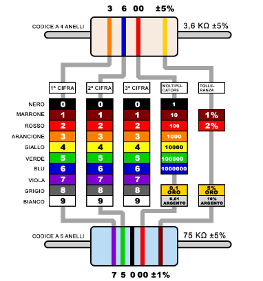
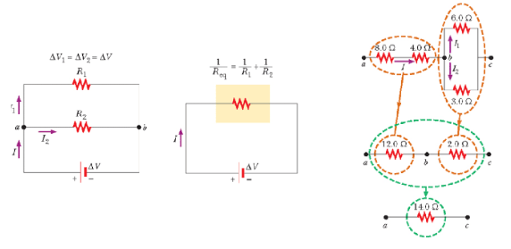
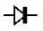
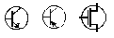
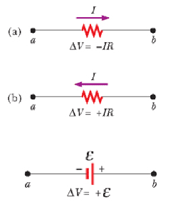

# Laboratorio IOT

### Parte 1 - Elettronica di base

- Tensione o differenza di potenziale (V, Volt): $`V = \frac{W}{Q}`$
    - Generatori di tensione (batterie e simili)
- Intensità di corrente (I, Ampere): $`I = \frac{Q}{t}`$
- Potenza (P, Watt): $`P = \frac{W}{t}`$
    - Il consumo di energia si può quindi ricavare come la potenza utilizzata in un certo periodo di tempo: $`W = P \times t`$ 
    - Modo alternativo di esprimere l'energia rispetto al Joule è il wattsecondo (Ws), wattora (Wh), kilowattora (kWh)
        - Es: una lampadina da 100W che rimane accesa per 10 ore consuma 1 kWh
- Campo elettrico
    - Lavoro (L, Joule): $`L = I \times \delta V \times \delta t`$
    - Potenza (P, Watt): $`P = I \times \delta V`$
- Corrente continua (DC): corrente il cui verso non varia nel tempo (prodotta da batterie)
- Corrente alternata (AC): il verso della corrente varia periodicamente nel tempo (prodotta da centrali elettriche)
- Resistenza (R, Ohm)
    - Legge di Ohm: $`V = R \times I`$
        - In un circuito con resistenza costante al variare della tensione varierà linearmente anche la corrente
        - In un circuito con tensione costante al variare della resistenza varierà la corrente
- Circuito elettrico
    - Affinché la corrente possa fluire il circuito deve essere chiuso
    - I componenti  sono collegati secondo schemi che rispettano le specifiche e la polarità dei vari componenti 
    - Potenza (P, Watt): $`P = V \times I = R \times I^{2} = \frac{V^{2}}{R}`$
- Componenti elettronici
    - Passivi: non introducono energia, non necessitano di alimentazione esterna (impedenze) 
        - Resistori (resistenze)
            - Potenza nominale: massima potenza che un resistore può dissipare senza essere danneggiato
                - E' opportuno scegliere resistori con potenza nominale doppia rispetto alla potenza che dovrà dissipare nel suo funzionamento normale
            - Colori

                

            - Disposizione
                - Serie: $`R_{eq} = R_{1} + R_{2}`$
                - Parallelo: $`R_{eq} = \frac{1}{(\frac{1}{R_{1}} + \frac{1}{R_{2}})}`$

                

        - Condensatori
            - Capacità dell'ordine del milionesimo di Farad
            - Disposizione
                - Parallelo: $`C_{eq} = C_{1} + C_{2}`$
                - Serie: $`C_{eq} = \frac{1}{(\frac{1}{C_{1}} + \frac{1}{C_{2}})}`$

                

        - Induttori: generano un campo magnetico al passare della corrente elettrica
        - Diodi e led: componente semiconduttore e, come tale, ha la proprietà di lasciare passare la corrente elettrica in una sola direzione
            - Polarizzato -> va inserito nel circuito rispettando la polarità 
            - Estremi denominati anodo (+) e catodo (-)
                - Corrente fluisce dall’anodo al catodo
            - Simbolo

                

    - Attivi
        - Transistori
            - A 3 terminali
                - Collettore
                - Base
                - Emettitore
            - La corrente fluisce da collettore all’emettitore a seconda del segnale alla base 
            - Viene utilizzato per amplificare un segnale, per pilotare dispositivi di potenza superiore o anche come interruttore elettronico
            - Simboli

                

- Analisi circuiti elementari
    - La corrente I scorre da dove il potenziale è più alto a dove è più basso
    - Tutti gli elementi hanno una resistenza che però è talmente piccola che possiamo trascurarla
- Leggi di Kirchoff
    - Prima legge - legge delle correnti (o dei nodi): la somma delle correnti entranti è uguale alla somma delle correnti uscenti
    - Seconda legge - legge delle tensioni (o delle maglie): la somma algebrica delle tensioni lungo una linea chiusa è pari a zero
    - La caduta di potenziale attraverso un elemento di circuito è pari alla differenza di potenziale ai capi
        
        

- Strumenti di misura
    - Amperometro
        - Misura la corrente che scorre in un circuito
        - Deve essere montato in serie
        - Resistenza interna piccola
    - Voltmetro
        - Misura la differenza di potenziale fra due punti di un circuito
        - Deve essere montato in parallelo
        - Resistenza interna molto grande
    - Tester/multimetri

### [Tutti gli esercizi svolti](https://github.com/andreazammarchi3/esiot-2122/tree/master)