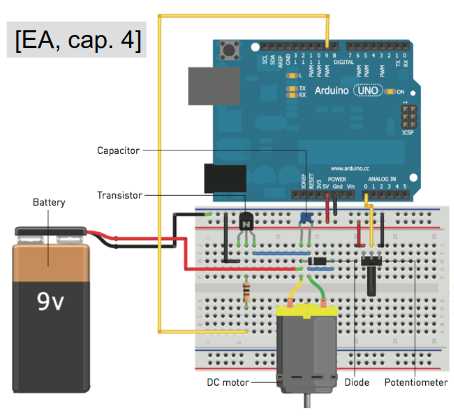
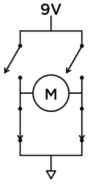
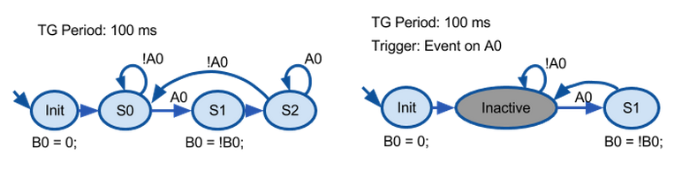

# Riassunto IOT

### Parte 1

- Sistemi embedded: sistemi di elaborazione special-purpose - ovvero che svolgono una specifica funzione o compito - incorporati (embedded) in sistemi o dispositivi elettronici di diverse dimensioni; il compito tipicamente richiede di  interagire con il mondo fisico mediante opportuni sensori e attuatori
- Funzionalità specifica: un sistema embedded tipicamente esegue uno specifico programma ripetutamente
- Caratteristiche
    - Risorse limitate: per questo la progettazione è orientata all'efficienza (energy efficient, code-size efficient, run-time efficient, weight efficient, cost efficient)
    - Affidabilità
        - Dependability, reliability, availability: alta probabilità di corretto e continuo funzionamento
        - Safety and security: alta probabilità che non rechi danni agli utenti o all’ambiente in cui è immerso e obtemperi norme di sicurezza e privacy 
    - Reattività: spesso i sistemi embedded sono utilizzati in contesti dove devono prontamente reagire a stimoli che provengono dall’ambiente (fisico) e quindi eseguire elaborazioni ed eventualmente azioni in real-time, senza ritardi
- Cyber-physical Systems: sistemi che integrano computazione con processi fisici
    - Gestione del tempo: non solo performance, ma correttezza
    - Concorrenza: processi fisici sono tipicamente in parallelo 
    - Reattività, eventi asincroni
    - Parti
        - Fisica
        - Computazionale/embedded
        - Rete
- Architettura
  
    

    

    - Processori
        - General-purpose (=> software): processori che hanno una architettura e un insieme di istruzioni (instruction set architecture, ISA) predefinito  e lo specifico comportamento è definito dal programma (software) in esecuzione
        - Single-purpose: circuiti digitali progettati per implementare la specifica funzionalità o programma (ASIC = Application-Specific Integrated Circuit)
            - Full-Custom/VLSI: l’implementazione avviene progettando l’intero processore in modo custom, ottimizzando tutti i livelli
            - Semi-custom: ASIC, in questo caso si parte da un certo insieme di livelli parzialmente o totalmente costruiti, implementandovi sopra il processore 
            - PLD (programmable logic device): tutti i livelli sono già presenti, quindi è possibile acquistare un IC per poi “programmarlo” opportunamente; i livelli implementano circuiti programmabili, dove la programmability è data dalla possibilità di creare/distruggere connessioni...
            - PLA (Programmable Logic Array): array programmabili di porte AND e array programmabili a porte OR
            - PAL (Programmable Array Logic): solo un tipo di array
            - FPGA (Field Programmable Gate Array): circuiti integrati con funzionalità programmabili via software, implementazione di funzioni logiche anche molto complesse (milioni di porte logiche), elevata scalabilità
        - Application-Specific Processors (ASIP): una via intermedia, processori programmabili, ottimizzati per una specifica classe di applicazioni avente caratteristiche comuni (anche in questo caso la logica viene specificata a livello software)
    - Sensori e attuatori
        - Sensori: dispositivi trasduttori che permettono di misurare una certo fenomeno fisico o rilevare e quantificare una concentrazione  chimica
            - Analogici: la grandezza elettrica prodotta in uscita - tensione o corrente - varia con continuità in risposta alla variazione della grandezza misurata (nel micro-controllore è tipicamente incluso un convertitore analogico digitale, ADC)
            - Digitali: due soli valori o insieme discreto di valori
        - Attuatori: dispositivi che producono un qualche effetto misurabile sull’ambiente, a partire da una specifica condizione o evento chiamato trigger
    - BUS e protocolli di comunicazione
        - Trasmissione seriale: parole multi-bit vengono inviate sequenzialmente come serie di bit 
        - Tipi: vari ma il più supportato e datato dei protocolli è UART/USART e altre che approfondiremo poi
            - UART (Universal Asynchronous Receiver-Transmitter): consente di convertire flussi di bit di dati da un formato parallelo a un formato seriale asincrono o viceversa
            - USART (Universal Synchronous/Asynchronous Receiver-Transmitter): estende il protocollo con la trasmissione di un segnale di clock per la sincronizzazione
    - Interfacce e tecnologie di comunicazione, wireless (Bluetooth and Bluetooth Low-Energy (BLE), ZigBee, Z-Wave, LoRoWan, Wifi...)
- Tecnologie
    - Micro-controllori (MCU): dispositivi elettronici, nati come evoluzione alternativa ai microprocessoriintegrando su singolo chip un sistema di componenti che permette di avere la massima autosufficienza funzionale per applicazioni embedded (8, 16, 32 bit); in generale i MCU sono meno performanti dei microprocessori
        - Single-board Micro-controller: soluzioni che incorporano in unica scheda il micro-controllore e tutta la circuiteria necessaria per eseguire dei compiti di controllo (Arduino)
    - SOC (System-on-a-chip): chip stesso che incorpora un sistema completo, che include CPU, memoria, controllori... tipicamente usati per creare delle single-board CPU (es: BROADCOM BCM2837 64bit ARMv8 Cortex A53  Quad Core (1.2Ghz), usato in Raspberry Pi 3)
    - Quale tecnologia usare (tendenza: MCU, Arduino e SOC, RPI)

        

- Progettazione sistemi embedded
    - Processo iterativo
        - Modeling: processo finalizzato ad ottenere un’approfondita comprensione o conoscenza relativamente al sistema da costruire; tale conoscenza è rappresentata da modelli, che sono il risultato di questo processo e rappresentano cosa il sistema deve fare
            - Modello: descrizione degli aspetti rilevanti del sistema, utili per la comprensione di proprietà del sistema stesso e della sua dinamica in particolare; un modello di un sistema embedded include tutte le tre parti (physical, computing, networking)
        - Design: processo finalizzato alla creazione degli artefatti tecnologici che rappresentano come il sistema fa quello che deve fare
            - Scegliere la tecnologia e architettura HW + scegliere l’architettura software più appropriata
            - Top-down o Bottom-up
                - Requisiti
                    - Funzionali: funzioni che deve svolgere il sistema
                    - Non-funzionali: performance, costo, dimensioni fisiche, peso, consumo energia e potenza...
                - Specifiche: descrizione più precisa e rigorosa dei requisiti, serve come contratto fra cliente e progettisti (UML)
                - Progettazione: descrive come il sistema implementa le funzioni descritte nella specifiche
                    - Architettura: piano della struttura complessiva del sistema, che verrà usata poi per guidare lo sviluppo dei componenti, descrive quindi quali componenti servono e come essi interagiscono
                        - Diagrammi a blocchi hardware e software
                    - Componenti: "costruzione" dei componenti (che possono anche essere ready-made)
                - Integrazione del sistema: integrazione dei componenti seguendo l’architettura (parte critica del design)
                - Sviluppo e programmazione
                - Deployment, debugging e testing
        - Analysis: processo finalizzato ad ottenere un’approfondita comprensione e conoscenza del comportamento del sistema; specifica perché un sistema fa quello che fa

### Parte 2

- Micro-controllore
    - Elementi
        - CPU
            - Architettura
                - Von Neumann: fetch, decode, execute
                - Harvard: istruzioni e dati sono memorizzate in memorie fisicamente separate (codice e dati possono essere letti/scritti parallelamente)
                    - Codice in FLASH memory
                    - Dati in SRAM
            - Funzionamento
                - Ha un suo Instruction Set Architecture (ISA)
                - Registri
                    - Programmabili (GPR)
                    - Dedicati (SFR)
                        - Program counter (PC): indirizzo della prossima istruzione da eseguire
                        - Program Status Word (PS): informazioni sullo stato del processore
        - Unità di memoria
            - Tipi
                - Flash (volatile)
                - SRAM (volatile)
                - EEPROM (non volatile)
            - I registri general-purpose e di I/O sono mappati in memoria
        - Porte di Input/Output (GPIO)
            - General purpose: possono fungere sai da input che da output
            - Tipi di pin
                - Digitali: può assumere solo due valori, HIGH o LOW (1 o 0) 
                - Analogici: può assumere un qualsiasi valore reale all’interno di un certo range
            - Parametri di funzionamento
                - Tensione (Volt): da applicare in input, prodotta in output
                - Corrente (Ampere): che può ricevere (input) o che può fornire (output)
                - Presenza o meno di circuiti/resistori di pull-up: per fissare il valore di tensione anche quando il circuito attaccato al pin è aperto ed evitare malfunzionamenti dovuti al floating del segnale
            - Costituite da uno o più registri special purpose (SRF) che storano le info, di cui uno mantiene lo stato del pin a cui la porta è associata
            - Manipolare i pin via software
                - `pinMode()`: setta la direzione INPUT/OUTPUT di un pin
                - `digitalWrite()`: imposta il valore di un pin di OUTPUT
                - `digitalRead()`: legge il valore di un pin di INPUT
        - Convertitori analogico/digitali
            - Un segnale analogico su un pin può assumere un valore continuo all'interno di un certo range; per poter elaborare un segnale analogico da un sistema di elaborazione (che lavora solo con valori digitali), questo deve essere convertito. La conversione avviene mediante un componente detto convertitore ADC (Analog-to-Digital), che mappa il valore continuo in un valore discreto
        - Timers 
            - Contatore che viene incrementato a livello HW ad una certa frequenza (configurabile), di cui si può leggere il valore e al quale è possibile agganciare interruzioni per implementare computazioni event-driven (time-triggered)
            - Watch dog: contiene un timer in grado di eseguire un conteggio fino ad un certo valore, dopo il quale genera un segnale di output con cui resetta il circuito
                - Funzionamento: riceve (periodicamente) un segnale prima che arrivi alla soglia, con cui resetta il conteggio; se non riceve il segnale in tempo, allora significa che il microprocessore è entrato in una situazione critica (es: blocco) e resetta il circuito
            - Power management: modalità che comportano livelli diversi di risparmio energetico
        - Bus e protocolli
            - Comunicazione seriale (bit a bit)
                - Tipi
                    - Sincronismo
                        - Asincroni
                            - Non viene utilizzato alcun clock per la sincronizzazione 
                            - Due linee: di trasmissione e ricezione
                            - Aspetti da stabilire
                                - Baud rate: quanto velocemente i dati sono inviati sulla linea seriale (bits-per-second, bps)
                                - Data frame: ogni blocco di dati - tipicamente un byte - è inviato in forma di pacchetto (packet o frame) di bit. Questi frame sono creati aggiungendo un synchronization e parity bit ai dati inviati

                                    

                                    - Il data chunk rappresenta le vere e proprie informazioni trasmesse; in ogni pacchetto si riescono ad inviare dai 5 ai 9 bit (8 solitamente)
                                    - Occorre specificare e accordarsi sull'endianness dei dati (default little endian)
                                    - I bit di sincronizzazione includono bit di start e stop, per segnare inizio e fine pacchetto
                                    - I bit di parità (opzionali) sono usati per avere una forma di low-level error checking
                        - Sincroni
                            - Per la sincronizzazione fra le parti che comunicano viene utilizzata una linea con un segnale di clock, che si affianca alla linea dove vengono trasmessi i dati
                            - Protocollo $`I^{2}C`$ (I2C)
                                - Architettura master-slave
                                    - Un I2C bus è controllato da un master device 
                                    - Contiene uno o più slave device che ricevono informazioni dal master
                                    - Più device condividono le stesse due linee di comunicazione 
                                        - Un clock signal (Serial Clock Line, SCL), che serve per sincronizzare la comunicazione
                                        - Una linea bidirezionale (Serial Data Line, SDA) per inviare e ricevere dati dal master agli slave
                                    - Funzionamento
                                        - Master invia start bit (broadcast a tutti gli slave)
                                        - Master invia l'id a 7 bit del dispositivo con cui vuole comunicare
                                        - Master invia read (0) o write (1) bit, a seconda che voglia scrivere dati nei registri del dispositivo o leggerli
                                        - Slave risponde con un ack (un ACK bit)
                                        - In write mode, il master invia un byte di informazioni alla volta e lo slave risponde con degli ACK; in read mode il master riceve 1 byte alla volta e invia un ACK dopo ogni byte 
                                        - Quando la comunicazione è finita, il master invia uno STOP bit
                            - Protocollo SPI
                                - Seriale full-duplex
                                - Master-slave
                                - Usa linee diverse per trasmettere e ricevere dati, e utilizza una linea per selezionare lo slave
                                - Funzionamento
                                    - Per comunicare ci sono 3 linee
                                        - Uno shared  clock signal (Shared Serial Clock, SCK) per sincronizzare la comunicazione (in Arduino pin 13)
                                        - Una linea Master Out Slave In (MOSI) per inviare i dati dal master allo slave (in Arduino pin 11)
                                        - Una linea Master In Slave Out (MISO) per inviare i dati dallo slave al master (in Arduino pin 12)
                                        - Una linea SS (Slave Select) per selezionare lo slave (in Arduino pin 10)
                                    - Multi-slave
                                        - Utilizzare più linee SS 
                                        - Utilizzare un collegamento daisy chain, in cui il master comunica con tutti gli slave simultaneamente
                    - "Duplexity"
                        - Un'interfaccia seriale dove entrambi i dispositivi possono inviare e ricevere dati può essere 
                            - Full-duplex: entrambi i dispositivi possono inviare e ricevere simultaneamente
                            - Half-duplex: i dispositivi a turno inviano e ricevono 
                        - Single-wire: alcuni bus seriali possono avere la necessità di un solo collegamento tra un dispositivo che invia e quello che riceve
                - Hardware
                    - 2 fili, uno invia e uno riceve
                    - 2 pin, un ricevitore (RX) e un trasmettitore (TX); quindi il pin RX di un dispositivo dovrebbe essere collegato a quello TX dell'altro dispositivo, e vice-versa
                    - UART (universal asynchronous receiver/transmitter): blocco circuitale che ha il compito di convertire i dati verso e dall'interfaccia seriale (agisce da intermediario fra l'interfaccia parallela e seriale)
            - Comunicazione parallela (più bit allo stesso tempo)
        - Oscillatore/clock 
        - Circuito di alimentazione
    - Programmazione
        - Mediante un sistema esterno (PC), scrivo e compilo il codice (in C/C++ con avr-gcc) e mediante un IDE (Arduino IDE) basato su Wire
        - Il binario viene mandato alla scheda 
        - Il software viene eseguito direttamente dal processore, non esiste il SO
    - Struttura eseguibile: super loop
        - setup(): prima esecuzione
        - loop(): per sempre
    - I/O e interruzioni
        - Il meccanismo delle interruzioni permette al micro-controllore (o meglio: al programma in esecuzione) di reagire ad eventi, evitando di fare polling
        - Le CPU mettono a disposizione uno o più pin, chiamati IRQ (Interrupt Request) e connessi ai GPIO, ove ricevere i segnali di interruzione; quando la CPU riceve una richiesta di interruzione, sospende l'esecuzione della sequenza di istruzioni, salva sullo stack  l'indirizzo della prossima istruzione che avrebbe eseguito  e quindi trasferisce il controllo alla interrupt routine corrispondente chiamata interrupt handler o interrupt service routine (ISR)
        - Programmare interrupt routine
            - `attachInterrupt(intNum, ISR, mode)`
                - Parametri
                    - intNum: numero interruzione (int)
                    - ISR: puntatore all’interrupt handler (tipo: void (*func)(void))
                    - mode: quando deve essere generata l’interruzione
                        - CHANGE/FALLING/RISING: ad ogni cambiamento logico (1 -> 0, 0 -> 1)
                        - LOW/HIGH: quando è 0 o 1 (logici)
            - Disabilitare interruzioni: mediante un bit nel registro di stato del processore
                - `noInterrupts()`
                - `interrupts()`
            - Design interrupt handler
                - Devono essere eseguiti in tempi brevi
                - Non possono mai bloccarsi o eseguire loop infiniti
                - Bassa interrupt latency (quantità di tempo che impiega il sistema per reagire ad una interruzione) 
                    - Nel caso in cui sia necessario eseguire compiti computazionali onerosi l'interrupt handler produce un task - in un buffer - che verrà successivamente eseguito ad esempio dal main loop
    - Esempio: Arduino UNO
        - MCU ATMega 328P (architettura Harvard)
            - AVR8: RISC, 8 bit codice, 16 bit dati, 16 MhZ
                - Registri
                    - 32 general-purpose ad 8 bit (R0–R31)
                    - Dedicati
                        - PC: 16 o 22 bit program counter
                        - SP: 8 o 16 bit stack pointer
                        - SREG: 8 bit status register
                            - C Carry flag: riporto, con istruzioni di sub
                            - Z Zero flag: settato quando un risultato aritmetico è 0 
                            - I Interrupt flag: settato quando le interruzioni sono abilitate
            - Flash memory: 32 KB (qui le istruzioni)
            - SRAM memory: 2 KB (qui lo stack), EEPROM: 1 KB (qui dati persistenti)
        - 14 pin digitali input/output (6 possono essere usati come uscite PWM)
            - Energia
                - Operano ad una tensione di 5V
                - Possono fornire o assorbire fino a 40mA di corrente
            - 3 porte da 8 bit l'una (B: pin 8..13, C: pin analogici, D: pin 0..7)
                - Registri
                    - Ogni porta è gestita da 3 registri (x è il nome della porta)
                        - DDRx: lettura/scrittura e contiene la direzione dei pin ad esso collegati (un bit a 0 => pin impostato come INPUT; un bit ad 1 => un pin impostato come OUTPUT)
                        - PORTx: questo registro è di lettura/scrittura e contiene lo stato dei pin, che cambia a seconda della direzione del pin
                            - Se il pin è impostato come INPUT, un bit ad 1 attiva la resistenza di PULL-UP, mentre un bit a 0 la disattiva
                            - Se il pin è impostato come OUTPUT, un bit ad 1 indica uno stato HIGH sul relativo pin, mentre un bit a 0 indica la presenza dello stato LOW sullo stesso pin 
                            - PINx: questo registro è di sola lettura e contiene, nel caso di un pin im4postato come INPUT, la lettura del segnale collegato al pin; 1 per un segnale alto (HIGH) e 0 per un segnale basso (LOW)
            - Funzioni specifiche
                - 0, 1: interfaccia seriale TTL
                - 2, 3: interruzioni
                    - Di default le interruzioni sono disabilitate quando l’handler è in esecuzione
                    - Non tutte le primitive di libreria funzionano se chiamate all’interno di un interrupt handler (non funzionano quelle funzioni il cui funzionamento si basa direttamente o indirettamente sull’uso di interruzioni)
                - 3, 5, 6, 9, 10, 11: PWM
                    - PWM (Pulse with modulation): tecnica di pilotaggio di dispositivi di output che permette di emulare in uscita un segnale analogico a partire dalla generazione di segnali digitali detti PWM
                        - Il segnale analogico di un certo valore V su un pin è “emulato” mediante un segnale periodico che si ottiene modulando  il duty cycle (percentuale di tempo che il segnale è ad 1 rispetto a quella in cui è a 0) di un’onda quadra, ovvero un segnale che passa ripetutamente da 0 ad 1
                - 10, 11, 12, 13: comunicazione SPI
                    - Pin
                        - 10: SS
                        - 11: MOSI
                        - 12: MISO
                        - 13: SCK
                    - SPI e Wiring
                        - Inizio sessione: `SPI.beginTransaction(settings)`
                            - Settings
                                - Massima velocità che il dispositivo può usare  
                                - Se i dati sono in formato MSB (Most Significant Bit) o LSB (Least Significant Bit) 
                                - Modalità relativa al sampling dei dati 
                                    - 4 modi di trasmissione, che specificando il fronte del clock sul quale i dati sono campionati o inviati (clock phase) e se il clock è idle quando vale HIGH e LOW (clock polarity)
                                        - `SPI_MODE0`: Pol = 0, Phase = 0
                                        - `SPI_MODE1`: Pol = 0, Phase = 1
                                        - `SPI_MODE2`: Pol = 1, Phase = 0
                                        - `SPI_MODE3`: Pol = 1, Phase = 1
                                    - Esempio: `SPI.beginTransaction(SPISettings(14000000, MSBFIRST, SPI_MODE0));`
                        - Trasferimento (invio e ricezione "simultanei")
                            - `receivedVal = SPI.transfer(val)`: val = byte da inviare sul bus
                            - `receivedVal16 = SPI.transfer16(val16)`: val16 = word da inviare nel bus
                            - `SPI.transfer(buffer, size)`: buffer = array di byte da inviare/ricevere
                        - Fine sessione: `SPI.endTransaction()`
                        - Interazione con uno slave
                            1. Si setta lo slave select pin a LOW (mediante digitalWrite sul pin SS)
                            2. Si chiama `SPI.transfer()` per trasferire i dati 
                            3. Si setta il pin SS a HIGH
                - 13: builtin led
        - 6 input analogici (solo input, porta C, A0-A5)
            - Energia
                - Operano ad una tensione di 5V
            - Ogni segnale analogico viene convertito in un valore a 10 bit, quindi da 0 a 1023 (funzione: `int analogRead(int PIN)`)
            - Funzioni specifiche
                - A4 e A5: I2C
        - Timer
            - 3 timer, ognuno dei quali ha un contatore che è incrementato ad ogni tick del clock del timer
                - timer0 e timer2 hanno i contatori a 8 bit
                - timer1 ha il contatore a 16 bit
            - Interruzioni
                - CTC (Clear Timer on Compare Match): le interruzioni del timer sono generate quando il contatore raggiunge un certo specifico valore (memorizzato nel compare match register); quando il contatore del timer raggiunge questo valore, resetta il conteggio al clock successivo e quindi riparte a contare
                    - I contatori sono incrementati a 16 MHz (per andare in overflow e ripartire ci mettono pochissimo)
                    - Questa frequenza può essere modulata specificando un valore detto prescaler (1, 8, 64, 256, 1024), che sostanzialmente funge da divisore della frequenza originaria
                    - `desired interrupt frequency (Hz) = 16,000,000 Hz / (prescaler * (compare match register + 1))`
                    - `compare match register = (16,000,000 Hz / (prescaler * desired interrupt freq)) - 1 (1 Hz = 1 s, capiscimi)`
                        - `timer 0 e 2: compare match register < 256`
                        - `timer 1: compare match register < 65526`
            - Registri
                - I registri dei timer che memorizzano la configurazione sono due e a 8 bit (x = numero del timer 1..3)
                    - TCCRxA
                    - TCCRxB (la modalità CTC si abilita attivando uno specifico bit di questo registro)
                        - 3 bit meno significativi (determinano la configurazione del clock del timer)
                            - CSx2 
                            - CSx1
                            - CSx0 
                - Il compare and match register è etichettato con OCRxA
            - Libreria ad alto livello: TimerOne
            - PWM: i timer vengono utilizzati anche per realizzare le uscite PWM
            - Siccome usiamo i timer per tante cose ci possono essere dei prolemi (guarda la documentazione per maggior informazioni)
            - Power management
                - 5 modalità di sleep (con risparmio crescente)
                    - Idle Mode
                    - ADC Noise Reduction Mode
                    - Power-save Mode
                    - Standby Mode
                    - Power-down Mode
                - Esempio
                    ```c
                    void sleepNow(){
                        set_sleep_mode(SLEEP_MODE_PWR_DOWN);   // sleep mode is set here
                        sleep_enable();    // enables the sleep bit in the mcucr register
                                        // so sleep is possible. just a safety pin
                        
                        attachInterrupt(0,wakeUpNow, LOW); // use interrupt 0 (pin 2) 
                                                        // and run function wakeUpNow 
                                                        // when pin 2 gets LOW
                                                        
                        sleep_mode();      // here the device is actually put to sleep!!
                                        // THE PROGRAM CONTINUES FROM HERE AFTER WAKING
                                        // UP
                        
                        sleep_disable();   // first thing after waking from sleep:   
                                        // disable sleep...
                        detachInterrupt(0);// disables interrupt 0 on pin 2 so the
                                        // wakeUpNow code will not be executed
                                        // during normal running time.
                    }
                    ```
        - Porta seriale 
            - 1 porta seriale hardware TTL, multiplexed sui GPIO 0 e 1 (connessi ai pin corrispondenti USB-to-TTL-serial chip che converte seriale TTL in USB e viceversa)
                - Pin 0 (RX): usato per ricevere
                - Pin 1 (TX): per trasmettere
            - Usando la libreria Serial la porta seriale può essere usata per mandare l'output al PC
        - Connettore USB (da cui si programma, trasferimento grazie ad un bootloader)
        - Power jack
        - ICSP header
        - Pulsante di reset
        - Operating voltage: 5V 
        - Input voltage (recom.): 7-12 V 
        - DC current per I/O pin: 40 mA 
        - DC current per 3.3V: 50mA
        - Durata alimentazione esterna
            - Esempio
                - Consumo stimato di 150mA e durata almeno 8 ore => capacità batteria >= 150mA*8 = 1200mAh

        

### Parte 3

- Un sistema embedded interagisce con l’ambiente in cui è situato mediante sensori e attuatori
    - Sensori
        - Dispositivi trasduttori che permettono di misurare una certo fenomeno fisico (come la temperatura, radiazioni, umidità, etc) o rilevare e quantificare una concentrazione  chimica (es: il fumo)
            - Le grandezze fisiche possono essere
                - Continue: valori continui all’interno di un certo intervallo (es: temperatura di un ambiente, velocità di rotazione di un motore, etc)
                    - Descritte da segnali analogici
                - Discrete: assumono un insieme discreto di valori (es. verso di rotazione di un motore, numero di pezzi lavorati al minuto, ecc...)
                    - Descritte da
                        - Segnali logici (due valori ammissibili)
                        - Segnali codificati (più di due valori ammissibili)
        - Fornisce una rappresentazione misurabile di un fenomeno su una certa specifica scala o intervallo (tipo una tensione in volt)
        - Possono essere analogici (se la grandezza elettrica prodotta in uscita - tensione o corrente - varia con continuità in risposta alla variazione della grandezza misurata) o digitali (insieme discreto di valori)
        - Funzionamento: basato su una legge fisica nota che regola la relazione grandezza fisica da misurare e grandezza elettrica d’uscita
        - Classificazione
            - Analogici: forniscono un segnale elettrico continuo a risoluzione infinita
            - Digitali: forniscono una informazione di tipo numerico con risoluzione finita
                - Logici: booleani
                - Codificati: uscita numerica codificata in una stringa di bits
        - Campionamento del segnale: acquisizione di campioni del segnale analogico ad istanti discreti di tempo e successiva conversione di questi in segnali digitali
            - Quantizzazione: operazione di approssimazione del valore campionato al più vicino valore digitale
            - Incertezza: può essere interpretata come il dubbio riguardante il risultato, ovvero la dispersione dei valori attribuibili al misurando (valore ± incertezza)
                - Errori
                    - Sistematici:  in grandezza e segno ha la stessa influenza sul risultato della misura
                    - Accidentali: errori la cui influenza sulla misura può cambiare in grandezza e segno se si ripete la procedura di misurazione (dati solitamente da n variabili ambientali)
                    - Grossolani: errori che riguardano l’operatore o guasti dello strumento
        - Caratteristiche metrologiche
            - Statiche: variata molto lentamente la variabile di ingresso del sensore, registrando la corrispondente variabile di uscita
                - Definite da Y = f(X) dove X rappresenta il segnale di ingresso e Y il segnale di uscita
                - La caratteristica è definita su di un intervallo finito chiamato campo di ingresso avente estremi Xm e XM ed ha valori sul campo di uscita (output range o span) con estremi Ym e YM
                    - Range d’ingresso: Xs = XM - Xm
                    - Range d’uscita: Ys = YM - Ym
                - La costante di proporzionalità fra valori di ingresso e di uscita viene chiamata guadagno (K) del trasduttore (idealmente è lineare) 
                    - I trasduttori commerciali hanno una caratteristica statica reale che si differenzia da quella ideale a causa di inevitabili imperfezioni costruttive quindi la qualità di un sensore si misura in base a quanto la caratteristica reale si scosta da quella ideale
                    - Per un trasduttore ideale la relazione tra la grandezza fisica misurata e il segnale in uscita è: Y = K X
            - Dinamiche: variabile di ingresso varia velocemente l’uscita può evidenziare un’attenuazione rispetto alla caratteristica statica ed un ritardo
        - Errori
            - Errore di linearità: massima deviazione dell’uscita del trasduttore rispetto alla caratteristica lineare che approssima al meglio la caratteristica reale
            - Errore di offset: valore d che assume l’uscita del trasduttore quando la grandezza da misurare è nulla (per rendere lineare la caratteristica occorre eliminare il termine di “offset” dalla caratteristica del trasduttore)
            - Errore di soglia: più basso livello di segnale rilevabile dal sensore (per rendere lineare la caratteristica occorre eliminare il termine di “soglia” dalla caratteristica del trasduttore)
            - Errore di guadagno: differenza tra il guadagno della caratteristica ideale del trasduttore (K) e il guadagno della retta (K1) che approssima al meglio la caratteristica reale del trasduttore
            - Errore di quantizzazione: l'operazione di quantizzazione comporta inevitabilmente l’introduzione di un errore sul segnale acquisito
        - Precisione vs Accuratezza
            - Accuratezza: misura di quanto il valore letto dal sensore si discosti dal valore corretto (spesso si fa riferimento invece all'incertezza)
                - Come si calcola: massimo scostamento tra la misura fornita dal sensore  e il  “valore  vero” del segnale misurato
                    - Esempio: un sensore di pressione che misura valori del range 0-10 bar con inaccuratezza pari a ± 1.0%; allora il massimo errore di misura è 10*1.0% = 10*0.01 = 0.1 bar
            - Precisione: descrive quanto un sensore sia soggetto o meno ad errori accidentali; se eseguiamo un numero elevato di letture con un sensore che ha precisione elevata, il range di tali valori sarà piccolo (alta precisione non implica elevata accuratezza)
            - Esempio
                - La larghezza di una stanza è stata misurata con un sensore ultrasuoni 10 volte riportando le seguenti misure: 5.381, 5.379, 5.378, 5.382, 5.380, 5.383, 5.379,  5.377, 5.380, 5.381
                - Misura corretta: 5.374m
                - Precisione
                    - Valor medio delle misure: 5.380
                    - Massima deviazione sotto il valore: 5.377-5.380 = -0.003
                    - Massima deviazione sopra il valore:  5.383-5.380 = +0.003
                    - Precisione: ± 0.003 m 
                - Massima inaccuratezza della misura = differenza fra il valore corretto e misura dal valore più distante = 5.383 - 5.374 = +0.009 m

            

        - Calibrazione e taratura
            - Calibrazione: aggiustamento dei parametri del sensore per farne corrispondere l’uscita a valori rilevati accuratamente con un altro strumento
            - Taratura: misurazione della grandezza di uscita per valori noti della grandezza di ingresso
        - Sensibilità: rapporto fra variazione della grandezza (segnale) di uscita e corrispondente variazione (segnale) d’ingresso
        - Risoluzione: capacità dello strumento (sensore) di risolvere stati (livelli) diversi del misurando
        - Ripetibilità: attitudine dello strumento a fornire per uno stesso misurando valori di lettura vicini tra loro, in letture consecutive eseguite in breve intervallo di tempo
        - Riproducibilità: vicinanza di risultati ottenuti sullo stesso misurando in diverse specifiche condizioni di misura
        - Stabilità: attitudine di uno strumento a fornire valori di lettura poco differenti tra loro in letture eseguite indipendentemente sullo stesso misurando in un intervallo di tempo definito
        - Comportamento dinamico: quando in ingresso al trasduttore applichiamo una sollecitazione a gradino (cioè un gradino della grandezza da misurare) l’uscita (risposta) varierà fino a raggiungere, dopo un certo tempo, un nuovo valore
            - Tempo di salita: tempo impiegato per passare dal 10% al 90% del valore finale
            - Tempo di risposta: tempo impiegato per raggiungere una percentuale prefissata del valore finale
        - Tipologie
            - Prossimità: rilevare la presenza di oggetti nelle immediate vicinanze del "lato sensibile" del sensore stesso, senza che vi sia un effettivo contatto fisico
                - Utilizzo
                    - Si invia un impulso sul pin Trig e misura quanto tempo impiega ad arrivare l'echo sul pin Echo; dato tale tempo è possibile ricavare la distanza

                

            - Movimento (es PIR): sensore elettronico che misura i raggi infrarossi (IR) irradiati dagli oggetti nel suo campo di vista che possono essere usati come rilevatori di movimento (variazioni di temperatura)

                

            - Accelerazione

                

                - Tipi
                    - Accelerometro: sensore che misura l'accelerazione a cui è soggetto l'oggetto a cui è connesso il sensore
                    - Giroscopio: dispositivo fisico rotante mantiene il suo asse di rotazione orientato in una direzione fissa (es d'uso: bussola)
                - Gli accelerometri e giroscopi elettronici citati si basano su tecnologia  MEMS: coniugano le proprietà elettriche degli integrati a semiconduttore con proprietà opto-meccaniche
            - Contatto
                - Pulsanti
                - Potenziometri
                - Capacitivi: il loro lato sensibile ne costituisce un’armatura, l’eventuale presenza nelle immediate vicinanze di un oggetto conduttore, realizza l’altra armatura del condensatore

                    

            - Pressione
            - Ottici: converte una immagine ottica in un segnale elettrico
                - Foto-rivelatori: rivelare la radiazione elettromagnetica (luce)
                    
                    

            - Elettricità e magnetismo
            - Tempo atmosferico e clima
                - Temperatura
                - Umidità 
                - Pressione
            - Sostanze chimiche
                - Fumo
            - Suono
            - GPS

                

            - Identificazione
                - RFID
                - NFC
            - Input dati
                - Keypad            
    - Attuatori (trasduttori di output): dispositivi che producono un qualche effetto misurabile sull’ambiente (analogici o digitali)
        - Permettono di realizzare sistemi embedded che eseguono e controllano azioni sull'ambiente fisico in cui sono immersi (azione più semplice: accendere o spegnere un dispositivo) 
        - Interfacciamento
            - Con alimentazione: mediante un GPIO si apre/chiude l’altro circuito mediante dispositivi come transistor e relè che fungono da “interruttori”
            - Senza alimentazione: è sufficiente la corrente/tensione in uscita ai GPIO per alimentare il trasduttore
        - Categorie
            - Carichi resistivi: possono essere assimilati ad un componente che al passaggio della corrente oppone una certa resistenza che implica una variazione della tensione
            - Carichi induttivi: dispositivi che operano inducendo corrente su un filo mediante la corrente su un altro filo o immergendo il filo in un campo magnetico 
        - Esempi
            - LED
            - Display LCD
                - Collegamento
                    - 4/8 pin: 6 pin sono da collegare ai pin digitali + 2 sono da collegare VCC e GND; dei 6 pin, 4 servono per trasmettere i dati, gli altri due per funzioni di controllo

                        

                    - I2C
                - Libreria LiquidCrystal fornita con Arduino IDE
                    ```c
                    #include <LiquidCrystal.h>
                    
                    int time = 0;
                    
                    /* sequenza dei pin: RS EN D4 D5 D6 D7 */
                    LiquidCrystal lcd(2, 3, 4, 5, 6, 7);
                    
                    void setup(){
                        lcd.begin(16, 2); // display 16 caratteri per 2 righe
                        lcd.print(“Cesena”);
                    }
                    
                    void loop(){
                        lcd.setCursor(0,1);
                        lcd.print(time);
                        delay(1000);
                        time++;
                    }
                    ```
            - Motori elettrici
                - Corrente continua (utili per fare per esempio le ruote di un robot)
                    - La corrente elettrica continua passa in un avvolgimento di spire che si trova nel rotore, composto da fili di rame, creando un campo elettromagnetico al passaggio di corrente
                    - Questo campo elettromagnetico è immerso in un altro campo magnetico creato dallo statore, il quale è caratterizzato dalla presenza di una o più coppie polari (calamite, elettrocalamite, ecc.)
                    - Il rotore per induzione elettromagnetica inizia a girare, in quanto il campo magnetico del rotore tende ad allinearsi a quello dello statore analogamente a quanto avviene per l'ago della bussola che si allinea col campo magnetico terrestre
                    - Durante la rotazione il sistema costituito dalle spazzole e dal collettore commuta l'alimentazione elettrica degli avvolgimenti del rotore in modo che il campo magnetico dello statore e quello del rotore non raggiungano mai l'allineamento perfetto, in tal modo si ottiene la continuità della rotazione

                    

                    - Alimentazione separata
                        - Perchè?
                            - Richiesta più corrente
                            - Picchi di tensione generati dal motore possono danneggiare l'arduino
                        - Schema

                            

                            - Q1 è un transistor usato come interruttore sull'alimentazione di 9V
                                - Modulando il pin base con un segnale PWM, si può controllare la velocità del motore, accendendo e spegnendo il transistor rapidamente
                                - Il duty cycle del segnale PWM determina la velocità del motore: duty cycle = 100% velocità massima (sempre acceso), duty cycle = 0% velocità nulla (motore non alimentato)

                                

                            - R1 è una resistenza da 1 KOhm usato per separare il morsetto base del transistore dal pin di controllo di Arduino
                            - U1 è il motore 
                            - C1 è una condensatore usato per filtrare il rumore generato dal motore 
                            - D1 è un diodo che protegge l'alimentazione dall'inversione di tensione causata dal motore
                        - Funzionamento
                            - Quando una tensione sufficientemente elevata viene applicata alla base, il circuito si chiude, la corrente fluisce e il motore gira 
                            - Se l'alimentazione viene rimossa in modo istantaneo (non graduale), allora l'energia contenuta nel motore viene dissipata in termini di picco di tensione inversa, che può danneggiare i componenti del circuito, per questo motivo si piazza un diodo di protezione (diodo di ricircolo) in parallelo al motore, che assicura che la corrente inversa generata dal motore fluisca nel diodo e che la tensione inversa non ecceda la tensione soglia di forward del diodo
                        - Sketch

                            

                        - Code
                            ```c
                            const int MOTOR = 9;
                            const int POT = 0;
                            int val = 0;
                            
                            void setup(){  
                                pinMode(MOTOR, OUTPUT);
                            }
                            
                            void loop(){  
                                val = analogRead(POT);  
                                val = map(val,0,1023,0,255);  
                                analogWrite(MOTOR,val);
                            }
                            ```
                    - Controllo della direzione del movimento
                        - E' possibile invertire il senso di marcia nel motore invertendo la polarità della tensione applicata ai morsetti; allo scopo nei circuiti si usa tipicamente un componente chiamato ponte H
                        - Il ponte integra 4 switch (realizzati da transistor) e tutta la circuiteria di protezione
                        - 4 stati operazionali
                            - Open: tutti gli switch aperti e il motore non gira

                                

                            - Forward: sono aperti due switch su diagonale opposta, la corrente fluisce e il motore si muove in una direzione

                                

                            - Braking: tutto il movimento residuo causato dal momento angolare viene cessato e il motore si ferma

                                

                            - Backward: sono aperti gli altri due switch su diagonale opposta, la corrente fluisce nel motore nella direzione opposta e il motore si muove nella direzione opposta

                                

                        - WARNING: se entrambi gli switch a sinistra o a destra vengono chiusi, si crea un corto fra la batteria e terra, la batteria si riscalda velocemente e potrebbe in alcuni casi prender fuoco o esplodere
                        - Sketch

                            

                        - Code (agli estremi porti il motore a velocità massima in una direzione o nell’altra, mentre a metà lo fermi)
                            ```c
                            const int EN = 9;  // Half bridge1 Enable
                            const int MC1 = 3; // Motor Control 1 
                            const int MC2 = 2; // Motor Control 2 
                            const int POT = 9; // POT on Analog pin 0
                            int val = 0; // memorizza valore potenziometro
                            int velocity = 0; // velocità desiderata (0-255)
                            
                            void forward(int rate){  
                                digitalWrite(EN, LOW);  
                                digitalWrite(MC1, HIGH);  
                                digitalWrite(MC2, LOW);  
                                analogWrite(EN, rate);
                            }
                            
                            void backward(int rate){  
                                digitalWrite(EN, LOW);  
                                digitalWrite(MC1, LOW);  
                                digitalWrite(MC2, HIGH);  
                                analogWrite(EN, rate);
                            }
                            
                            void brake(){  
                                digitalWrite(EN, LOW);  
                                digitalWrite(MC1, LOW);  
                                digitalWrite(MC2, LOW);  
                                digitalWrite(EN, HIGH);
                            }
                            
                            void loop(){  
                                val = analogRead(POT);  

                                if (val > 562){    
                                    velocity = map(val, 563, 1023, 0, 255);
                                    forward(velocity);  
                                } else if (val < 462) {    
                                    velocity = map(val, 0, 461, 0, 255);    
                                    forward(velocity);  
                                } else {    
                                    brake();  
                                }
                            }
                            ```

                - Passo-passo (la posizione del motore può essere controllata accuratamente, usati nelle stampanti 3D)

                    

                - Servo

                                        
                    - Si controllano specificando precisamente l’angolo al quale devono posizionare l’albero (-90 a +90 gradi)
                        - Libreria: Servo
                            - Esempi
                                - [Knob](https://www.arduino.cc/en/Tutorial/Knob): controllo mediante un potenziometro analogico
                                - [Sweep](https://www.arduino.cc/en/Tutorial/Sweep97): continua rotazione avanti indietro 
                    - Tre fili
                        - 2 per l’alimentazione (nero => GND, rosso => +5V)
                        - 1 come segnale di controllo digitale (bianco/giallo)
                    - Controllo: inviando uno stream di impulsi al segnale di controllo ad una specifica frequenza (50 Hz); la lunghezza dell’impulso determina l’angolo al quale vogliamo portare il servo (da 1 ms, -90, a 2  ms, +90)
                    - Collegamento

                        

                    - Esempio di programma (i porta il servo ripetutamente dalla posizione -90 a +90)
                        ```c
                        int servoPin = 2;
                        
                        /* Invia un impulso della durata specificata (in microsecondi) e quindi attende 15 ms.
                        In realtà, per avere un segnale a 50 Hz, l’attesa dovrebbe essere pari a 1000/50 = 20ms tuttavia le istruzioni che vengono eseguite ciclicamente hanno una durata non nulla, per cui è stato scelto empiricamente un periodo inferiore.
                        In questo caso la lunghezza dell’impulso che corrisponde a -90 è circa 250ms, mentre +90 è circa 2250 ms */
                        void pulseServo(int servoPin, int pulseLen){
                            digitalWrite(servoPin, HIGH);
                            delayMicroseconds(pulseLen);
                            digitalWrite(servoPin,LOW);
                            delay(15);
                        }
                        
                        int c;
                        enum { MINUS_90, PLUS_90 } state;
                        
                        void setup(){
                            pinMode(servoPin, OUTPUT);
                            state = MINUS_90;
                            Serial.begin(9600);
                            c = 0;
                        }
                        
                        void loop(){
                            c++;
                            switch (state){
                                case MINUS_90:
                                    pulseServo(servoPin, 250);
                                    if (c > 100){
                                        Serial.println("--> +90");
                                        state = PLUS_90;
                                        c = 0;
                                    }
                                    break;
                                case PLUS_90:
                                    pulseServo(servoPin, 2250);
                                    if (c > 100){
                                        Serial.println("--> -90");
                                        state = MINUS_90;        
                                        c = 0;      
                                    }  
                            }
                        }
                        ```
            - Pilotaggio di circuiti esterni mediante relè e fotoaccoppiatori
                - Relè: permette di aprire e chiudere il secondo circuito mediante l’azione di un elettro-magnete, pilotato dal primo circuito
                    - Come nei motori è necessario usare opportuni diodi per evitare danni ai componenti
                - Fotoaccoppiatori: basati su un led interno, pilotato dal circuito a bassa tensione; quando il led viene illuminato, attiva una fotocellula e quindi l’interruttore del secondo circuito si chiude
            - Shift register: convertire input sequenziale/parallelo in output parallelo/sequenziale
                - La conversione (seriale => parallelo) è fatta mediante registri SIPO (Serial In Parallel Out), dispositivi che accettano in ingresso uno stream sequenziale di bit e fornisce in uscita l'output di tali bit come porta di I/O parallela
                - Segnali in input
                    - Segnale CLOCK: sincronizza l'acquisizione dei dati in input
                    - Segnale DATA: pin dove insiste lo stream di bit in input
                    - Segnale LATCH: campiona l'output e lo rende disponibile
                - Funzionamento (caricamento valore 10101010)
                    - Device sincrono, che acquisisce il valore dei bit in input al fronte di salita del segnale del clock
                        - Ad ogni fronte, tutti i valori al momenti presenti nel registro vengono fatti scorrere a sinistra di una posizione e viene introdotto il nuovo bit
                        - Il pin LATCH è attivato alla fine dell'acquisizione

                        
                - Esempio (pilotaggio 8 led in Arduino, mediante 3 segnali)
                    - Sketch

                        

                    - Code 
                        ```c
                        const int SER = 8;
                        const int LATCH = 9;
                        const int CLK = 10;
                        
                        void setup(){  
                            pinMode(SER,OUTPUT);  
                            pinMode(LATCH,OUTPUT);  
                            pinMode(CLK,OUTPUT);  
                            digitalWrite(LATCH,LOW);  
                            shiftOut(SER,CLK, MSBFIRST, B10101010);  
                            digitalWrite(LATCH,HIGH);
                        }
                        void loop(){}
                        ```
                    - Daisy chain
                        - Pilotare un numero maggiore di uscite usando più shift register è possibile mediante collegamenti daisy-chain
                            - Collegando il pin QH’ al pin DATA di un altro shift register il pin QH’ contiene il valore del bit più significativo che ad ogni shift “esce”, facendo posto a quello meno significativo  
                            - Facendo in modo che tutti gli shift register coinvolti condividano i segnali LATCH e CLOCK
                            - Nel caso di un numero elevato di led è necessario disporre di alimentazione supplementare, oltre a quella fornita da Arduino

- Livelli di tensione differenti
    - I sensori/attuatori per sistemi embedded possono funzionare con livelli di tensione diversa, ad esempio 5 Volt (Arduino) e 3.3 Volt (Raspberry Pi)
    - Un modo per adattare livelli di tensione è utilizzare circuiti chiamati partitori di tensione

### Parte 4

- Approcci sviluppo software
    - Top-down: partiamo dal dominio e dalla sua modellazione con paradigmi di alto livello
        - Modellazione: in che modo concettualizzo, rappresento, progetto un sistema software e in che modo analizzo e formulo la soluzione di un problema in certo dominio applicativo
            - Modello: rappresentazione degli aspetti salienti del sistema, astraendo da quelli che non sono significativi
            - Concetti fondamentali
                - Struttura: come sono organizzate le varie parti
                - Comportamento: comportamento computazionale di ogni singola parte
                - Interazione: come interagiscono le varie parti
            - Paradigmi: definiscono un insieme coerente di concetti e i principi con cui definire i modelli
                - Object-oriented
                    - Modularità 
                    - Incapsulamento 
                    - Meccanismi per riuso ed estendibilità
            - Linguaggio di modellazione: forniscono un modo rigoroso non ambiguo per rappresentare i modelli (es: UML)
            - Modellazione su micro-controllore
                - Elementi
                    - Controllore: incapsula la logica di controllo per lo svolgimento del compito o dei compiti del sistema
                    - Elementi controllati: modellano le risorse gestite/utilizzate dal controllore per svolgere il compito
                - Esempio (button-led)

                    

                    - Led

                        

                        ```c
                        // Light.h
                        #ifndef __LIGHT__
                        #define __LIGHT__
                        
                        class Light {
                            public:  
                                virtual void switchOn() = 0;  
                                virtual void switchOff() = 0;    
                        };
                        #endif
                        
                        // Led.h
                        #ifndef __LED__
                        #define __LED__
                        #include "Light.h"
                        
                        class Led: public Light { 
                            public:  
                                Led(int pin);  
                                void switchOn();  
                                void switchOff();    
                            protected:  
                                int pin;  
                        };
                        #endif
                        
                        // Led.cpp 
                        #include "Led.h"
                        #include "Arduino.h"
                        
                        Led::Led(int pin){  
                            this->pin = pin;  
                            pinMode(pin,OUTPUT);
                        }
                        
                        void Led::switchOn(){  
                            digitalWrite(pin,HIGH);
                        }
                        void Led::switchOff(){  
                            digitalWrite(pin,LOW);
                        }
                        ```
                    - Button

                        

                        ```c
                        // Button.h
                        #ifndef __BUTTON__
                        #define __BUTTON__
                        
                        class Button {
                            public:   
                                virtual bool isPressed() = 0;
                        };
                        #endif
                        
                        // ButtonImpl.h
                        #ifndef __BUTTONIMPL__
                        #define __BUTTONIMPL__
                        #include "Button.h"
                        
                        class ButtonImpl: public Button { 
                            public:   
                                ButtonImpl(int pin);  
                                bool isPressed();
                            protected:  
                                int pin;
                        };
                        #endif
                        
                        // ButtonImpl.cpp
                        #include "ButtonImpl.h"
                        #include "Arduino.h"
                        
                        ButtonImpl::ButtonImpl(int pin){  
                            this->pin = pin;  
                            pinMode(pin, INPUT);     
                        } 
                        
                        bool ButtonImpl::isPressed(){  
                            return digitalRead(pin) == HIGH;
                        }
                        ```
                    - Main
                        ```c
                        #include "Led.h"
                        #include "ButtonImpl.h"
                        #define LED_PIN 13
                        #define BUTTON_PIN 2
                        
                        Light* light;
                        Button* button;
                        boolean lightOn;
                        
                        // Creazione oggetti
                        void setup(){  
                            light = new Led(LED_PIN);    
                            button = new ButtonImpl(BUTTON_PIN);  
                            lightOn = false;
                        }
                        
                        // Main
                        void loop(){  
                            if (!lightOn && button->isPressed()){    
                                light->switchOn();    
                                lightOn = true;  
                            } else if (lightOn && !button->isPressed()){    
                                light->switchOff();    
                                lightOn = false; 
                            }
                        };
                        ```
            - Modello "totale" = loop + agenti
                - Modello a loop: ad ogni ciclo il controller legge gli input di cui necessita e sceglie le azioni da compiere, la scelta dipende dallo stato in cui si trova; l'azione può cambiare anche lo stato interno
                    - Note
                        - Efficienza: quando il controllore è in idle in realtà sta ciclando a vuoto
                        - Reattività: dipende da quanto rapidamente viene completato un ciclo, se durante l’esecuzione del ciclo avvengono ripetute variazioni di stato nei sensori, tali variazioni non vengono rilevate
                    - Basato sulla decomposizione per task
                - Modello ad agenti: entità attive (es: controllore), dotate di un flusso di controllo logico autonomo, progettate per svolgere uno o  più  compiti (task) che richiedono di elaborare informazioni che provengono in input dall’ambiente da sensori e di agire su attuatori in output,  eventualmente comunicando con altri agenti
                    - Basato sulla decomposizione per task (agente = esecutore di uno o più task)
    - Bottom-up: partiamo dalle caratteristiche a livello hardware e dal comportamento che il sistema deve avere a questo livello

### Parte 5

- Macchine a stati finiti di Mealy (automi a stati finiti): modello discreto cioè che opera in una sequenza di passi discreti e la sua dinamica è caratterizzata da sequenze di eventi discreti

    

    - Segnali input/output
        - I segnali u e d di input (up e down) che rappresentano il succedersi di eventi discreti possono essere rappresentati come funzioni
            - u: ℝ ⟶ { absent, present }
                - Segnale puro: che trasporta la sola assenza/presenza di un evento
        - Il segnale di uscita può essere rappresentato invece con una funzione
            - c: ℝ ⟶ { absent } U ℕ
                - Non è un segnale puro poichè ha contenuto informativo
        - Modellazione input/output: mediante variabili a cui la macchina può accedere
            - Variabili di input: modificate dall’ambiente in cui opera la macchina
            - Variabili di output: modificate dalla macchina stessa mediante azioni, come controllo dell’ambiente
    - Reazioni: step (passi), ognuno dei quali si presuppone sia istantaneo, ovvero abbia durata nulla
        - Scatenate (triggered) dall'ambiente in cui opera il sistema
            - Scatenate da eventi di input: event-triggered
    - Valutazione input/output: l’esecuzione di una reazione comporta la valutazione degli input e degli output, salvati nelle rispettive variabili
    - Stato: rappresenta tutto ciò che è successo nel passato che ha un effetto nel determinare la reazione del sistema agli input correnti e futuri
    - Transizioni: coinvolge sempre due stati e può essere rappresentata da due elementi
        - Guardia: è una funzione booleana sulle variabili di input e specifica le condizioni per cui la transizione può avvenire
        - Azione: specifica il valore che devono assumere le variabili di output come risultato della transizione; se una variabile di output non viene specificata, si assume implicitamente che assuma il valore absent
    - Tipi
        - Asincrone (event-triggered): la reazione avviene a fronte di un evento di input, quindi è l’ambiente in cui opera la macchina che stabilisce quando la valutazione e quindi le reazioni devono avvenire
        - Sincrone (time-triggered): le reazioni avvengono ad intervalli regolari di tempo; è definito un periodo e quindi una frequenza di funzionamento
            - Esempio in pseudocodice
                ```cpp
                volatile int timerFlag = 0;
                
                void timerISR(){  
                    timerFlag = 1;
                }
                
                /* procedure implementing the step of the state machine */
                void step(){...} 
                
                loop(){  
                    while (!timerFlag){}; /* wait for a tick for doing the next step */
                    timerFlag = 0;  
                    step();
                }
                ```
            - Esempio reale (Blink)
                ```cpp
                #include "Led.h"
                #include "Timer.h"
                
                #define LED_PIN 13
                
                Light* led;
                Timer timer;

                enum { ON, OFF} state;
                
                void step(){  
                    switch (state){    
                        case OFF:      
                            led->switchOn();      
                            state = ON;      
                            break;    
                        case ON:      
                            led->switchOff();      
                            state = OFF;      
                            break;  
                    }
                }

                void setup(){  
                    led = new Led(LED_PIN);   
                    state = OFF;  
                    timer.setupPeriod(500);
                }
                
                void loop(){  
                    timer.waitForNextTick();  
                    step();
                }
                ```
            - Più intervalli temporali di lunghezza diversa
                - Come periodo si sceglie il massimo comun divisore dei vari intervalli
                - Esempio (Blink)
                    - LED acceso per 500 ms e spento per 750 ms => si sceglie periodo di 250 ms
            - Campionamento input: lettura periodica di un sensore ad una data frequenza
                - Caratterizzato da un certo il periodo di campionamento (sampling rate)
                    - Scelta periodo di campionamento: deve essere il più grande (per risparmio energetico) fra i valori sufficientemente piccoli (per perdita input) da garantire il corretto funzionamento del sistema
                - Minimum event separation time (MEST): intervallo più piccolo che - dato l’ambiente in cui opera il nostro sistema - può esserci fra due eventi di input (scegliendo un periodo inferiore al MEST si garantisce che tutti gli eventi saranno rilevati )
            - Latenza: intervallo che trascorre tra l'evento di input e la generazione dell'output
                - Obiettivo: minimizzare la latenza     
            - Condizionamento dell'input
                - Button bouncing: il segnale corrispondente passa da un valore LOW ad un valore HIGH e viceversa più volte, prima di assestarsi su valore HIGH (sembra che il pulsante sia stato premuto più volte)
                    - Fix: button de-bouncing
                        - Va considerata una frequenza di campionamento inferiore alla frequenza del bouncing (basta modificare il periodo del timer)
                - Glitch/spike: segnali spuri dovuti alle condizioni ambientali
                    - Fix
                        - Riduzione del periodo di campionamento (non elimina il problema)
                        - Richiedere che il segnale rilevato che rappresenta uno specifico evento, per essere considerato tale, abbia una certa durata minima (non elimina il problema)
                            - Esempio: per un periodo di campionamento di 50 ms di un pulsante e glitch durano al più 10 ms, possiamo richiedere che una serie di 2 campionamenti siano rilevati ad HIGH per poter considerare il pulsante premuto
        - Esempio (può essere implementato in tutti e due i modi)
            - HVAC (heating, ventilation, air conditioning)

                

     - Importante: per corretto funzionamento
        - Ogni azione deve sempre terminare, non ci devono essere loop infiniti
        - La valutazione di una condizione non deve cambiare lo stato delle variabili
    - Mapping Macchina a stati -> Codice
        - Rappresentazione esplicita stati con costanti enumerative
        - Variabile che tiene traccia dello stato corrente
        - step() della macchina nel main loop caratterizzato da un costrutto di selezione sullo stato corrente, con un ramo per ogni stato; a seconda dello stato si eseguono le azioni associate alla transizione e si cambia stato, riassegnando la variabile relativa allo stato corrente
        - Esempio
            - FSM

                

            - Code
                ```c
                enum States { LightOn, LightOff } 
                
                statesetup(){  
                    state = LightOff
                }
                
                step() {  
                    switch (state){    
                        case LightOff:      
                            if (button.isPressed()){        
                                light.switchOn()        
                                state = LightOn      
                            }     
                        case LightOn:      
                            if (!button.isPressed()){        
                                light.switchOff()        
                                state = LightOff      
                            }  
                    }
                }
                
                loop {  
                    step()
                }
                ```
    - State pattern
        - Diagram

            

        - Code
            ```cpp
            // State
            interface State {  
                do()  
                nextState(): State
            }
            class MyState1 implements State {...}
            class MyState2 implements State {...}

            // Loop
            state = initialState
            loop { 
                state.do() 
                state = state.nextState()
            }
            ```
    - Extended FSM (per macchine a stati articolate)
        - Esempio generico

            

        - Esempio di time triggered EFSM (Semaforo pedonale, periodo = 1s)

            

        - Numero di stati: include tutti quelli che derivano da ogni possibile configurazione ammissibile delle variabili di stato
            - Con
                - n = numero stati discreti
                - m = numero variabili che descrivono lo stato
                - p = possibili valori che può assumere ogni variabile
            - Si ha: $`|States| = n \times p^{m}`$

### Parte 6

- Task concorrenti
    - Decomposizione del comportamento complessivo in più task
        - Ogni task rappresenta un compito ben definito, una unità di lavoro da svolgere
        - Il comportamento di ogni task può essere descritto da una opportuna macchina a stati
        - Il comportamento complessivo è dall’insieme delle macchine a stati
        - Esempio: Led Show con 4 LED
            - Blinking di un led ogni 500 ms
            - Contemporaneamente: gestione di 3 led di cui se ne accenda uno alla volta, in sequenza, ogni 500ms

            
    - Pro
        - Modularità
        - Chiarezza, manutenibilità, estendibilità, riusabilità
    - Contro
        - L'esecuzione dei task si sovrappone nel tempo
        - Va gestita la sincronizzazione (mutua esclusione, comunicazione)
    - Sistemi multi-tasking
        - Modelleremo ogni task come classe separata che estende da una classe base task, in cui è definito il metodo step, specializzato in ogni classe concreta; quindi nel programma avremo una sola istanza di questa classe (pattern singleton)
            - Esempio

                

                ```cpp
                // Classe astratta Task
                #ifndef __TASK__
                #define __TASK__
                
                class Task {
                    public:  virtual void init() = 0;  
                    virtual void tick() = 0;
                };
                
                #endif

                // BlinkTask
                // BlinkTask.h
                #ifndef __BLINKTASK__
                #define __BLINKTASK__
                
                #include "Task.h"
                #include "Led.h"
                
                class BlinkTask: public Task {  
                    int pin;  
                    Light* led;  
                    enum { ON, OFF} state;
                    
                    public:  
                        BlinkTask(int pin);    
                        void init();    
                        void tick();
                };
                    
                #endif

                // BlinkTask.cpp
                #include "BlinkTask.h"

                BlinkTask::BlinkTask(int pin){  
                    this->pin = pin;    
                }
                
                void BlinkTask::init(){  
                    led = new Led(pin);   
                    state = OFF;    
                }
                
                void BlinkTask::tick(){  
                    switch (state){    
                        case OFF:      
                            led->switchOn();      
                            state = ON;       
                            break;    
                        case ON:      
                            led->switchOff();      
                            state = OFF;      
                            break;  
                    }
                }

                // Three Leds Task
                // ThreeLedsTask.h
                #ifndef __THREELEDSTASK__
                #define __THREELEDSTASK__
                
                #include "Task.h"
                #include "Led.h"
                
                class ThreeLedsTask: public Task {  
                    int pin[3];  
                    Light* led[3];  
                    int state;
                    
                    public:  
                        ThreeLedsTask(int pin0, int pin1, int pin2);    
                        void init();    
                        void tick();
                    };
                #endif

                // ThreeLedsTask.cpp
                #include "ThreeLedsTask.h"
                
                ThreeLedsTask::ThreeLedsTask(int pin0, int pin1, int pin2){
                    this->pin[0] = pin0;      
                    this->pin[1] = pin1;      
                    this->pin[2] = pin2;    
                }
                
                void ThreeLedsTask::init(){  
                    for (int i = 0; i < 3; i++){    
                        led[i] = new Led(pin[i]);   
                    }  
                    state = 0;    
                }
                
                void ThreeLedsTask::tick(){  
                    led[state]->switchOff();  
                    state = (state + 1) % 3;  
                    led[state]->switchOn();
                }

                // Main
                #include "Timer.h"
                #include "BlinkTask.h"
                #include "ThreeLedsTask.h"
                
                Timer timer;
                
                BlinkTask blinkTask(2);
                ThreeLedsTask threeLedsTask(3,4,5);
                
                void setup(){  
                    blinkTask.init();  
                    threeLedsTask.init();  
                    timer.setupPeriod(500);
                }
                
                void loop(){  
                    timer.waitForNextTick();  
                    blinkTask.tick();  
                    threeLedsTask.tick();
                }
                ```
        - Gestione periodi diversi
            - Tenere traccia per ogni task anche del periodo specifico
            - Periodo = massimo comun divisore dei periodi
            - Tener traccia per ogni task del tempo trascorso e nel caso si sia raggiunto il valore del periodo, richiamare il tick
            - Esempio 
                ```cpp
                // Task
                #ifndef __TASK__
                #define __TASK__
                
                class Task {  
                    int myPeriod;  
                    int timeElapsed;
                    public:  
                        virtual void init(int period){    
                            myPeriod = period;      
                            timeElapsed = 0;  
                        }  
                        
                        virtual void tick() = 0;  
                        
                        bool updateAndCheckTime(int basePeriod){    
                            timeElapsed += basePeriod;    
                            if (timeElapsed >= myPeriod){      
                                timeElapsed = 0;      
                                return true;    
                            } else {      
                                return false;     
                            }  
                        }
                };
                    
                #endif

                // Blink Task
                // BlinkTask.h
                #ifndef __BLINKTASK__
                #define __BLINKTASK__

                #include "Task.h"
                #include "Led.h"
    
                class BlinkTask: public Task {  
                    int pin;  
                    Light* led;  
                    enum { ON, OFF} state;
                        
                    public:  
                        BlinkTask(int pin);    
                        void init(int period);    
                        void tick();
                };
                    
                #endif

                // BlinkTask.cpp
                #include "BlinkTask.h"
                    
                BlinkTask::BlinkTask(int pin){  
                    this->pin = pin;    
                }
                    
                void BlinkTask::init(int period){  
                    Task::init(period);  
                    led = new Led(pin);   
                    state = OFF;    
                }
                    
                void BlinkTask::tick(){  
                    switch (state){    
                        case OFF:      
                            led->switchOn();      
                            state = ON;       
                            break;    
                        case ON:      
                            led->switchOff();      
                            state = OFF;      
                            break;  
                    }
                }
                
                // Three Leds Task
                // ThreeLedsTask.h
                #ifndef __THREELEDSTASK__
                #define __THREELEDSTASK__
                
                #include "Task.h"
                #include "Led.h"
                
                class ThreeLedsTask: public Task {  
                    int pin[3];  
                    Light* led[3];  
                    int state;
                    
                    public:  
                        ThreeLedsTask(int pin0, int pin1, int pin2);
                        void init(int period);    
                        void tick();
                    };
                
                #endif

                // ThreeLedsTask.cpp
                #include "ThreeLedsTask.h"
                
                ThreeLedsTask::ThreeLedsTask(int pin0, int pin1, int pin2){
                    this->pin[0] = pin0;      
                    this->pin[1] = pin1;      
                    this->pin[2] = pin2;    
                }
                
                void ThreeLedsTask::init(int period){  
                    Task::init(period);  
                    for (int i = 0; i < 3; i++){    
                        led[i] = new Led(pin[i]);   
                    }  
                    state = 0;    
                }
                
                void ThreeLedsTask::tick(){  
                    led[state]->switchOff();  
                    state = (state + 1) % 3;  
                    led[state]->switchOn();
                }

                // Main
                #include "Timer.h"
                #include "BlinkTask.h"
                #include "ThreeLedsTask.h"
                
                const int basePeriod = 50;
                
                Timer timer;
                
                BlinkTask blinkTask(2);
                ThreeLedsTask threeLedsTask(3,4,5);
                
                void setup(){  
                    timer.setupPeriod(basePeriod);  
                    blinkTask.init(500);  
                    threeLedsTask.init(150);
                }
                
                void loop(){  
                    timer.waitForNextTick();  
                    if (blinkTask.updateAndCheckTime(basePeriod)){    
                        blinkTask.tick();  
                    }  
                    if (threeLedsTask.updateAndCheckTime(basePeriod)){   
                        threeLedsTask.tick();  
                    }
                };
                ```
        - Scheduler cooperativo
            - Nel main loop si visita ogni elemento in coda, richiedendone il tick nel caso in cui il tempo trascorso sia pari al periodo previsto dal task
            - Esempio
                ```cpp
                // Scheduler.h
                #ifndef __SCHEDULER__
                #define __SCHEDULER__
                
                #include "Timer.h"
                #include "Task.h"
                
                #define MAX_TASKS 10
                
                class Scheduler {  
                    int basePeriod;  
                    int nTasks;  
                    Task* taskList[MAX_TASKS];    
                    Timer timer;
                    public:  
                        void init(int basePeriod);  
                        virtual bool addTask(Task* task);  
                        virtual void schedule();
                };
                
                #endif

                // Scheduler.cpp
                #include "Scheduler.h"
                
                void Scheduler::init(int basePeriod){  
                    this->basePeriod = basePeriod;  
                    timer.setupPeriod(basePeriod);    
                    nTasks = 0;
                }
                
                bool Scheduler::addTask(Task* task){  
                    if (nTasks < MAX_TASKS-1){    
                        taskList[nTasks] = task;    
                        nTasks++;    
                        return true;  
                    } else {    
                        return false;   
                    }
                }
                
                void Scheduler::schedule(){  
                    timer.waitForNextTick();  
                    for (int i = 0; i < nTasks; i++){    
                        if (taskList[i]->updateAndCheckTime(basePeriod)){   
                            taskList[i]->tick();    
                        }  
                    }
                }

                // Main
                #include "Scheduler.h"
                #include "BlinkTask.h"
                #include "ThreeLedsTask.h"
                
                Scheduler sched;

                void setup(){  
                    sched.init(50); 

                    Task* t0 = new BlinkTask(2);  
                    t0->init(500);  
                    sched.addTask(t0);  
                    
                    Task* t1 = new ThreeLedsTask(3,4,5);  
                    t1->init(150);  
                    sched.addTask(t1);  
                }
                
                void loop(){  
                    sched.schedule();
                }
                ```
        - Dipendenze fra task
            - Tipi
                - Temporale: un task T3 può essere eseguito solo dopo che sono stati eseguiti T1 e T2
                - Produttore/consumatore: un task T1 ha bisogno di una informazione prodotta da un task T2
                - Relative a dati: task T1 e T2 necessitano di condividere dati
                - ...
            - Soluzione: variabili condivise
                - Potrebbero verificarsi corse critiche, per evitarlo si definisce che le transizioni di ogni macchina a stati sono eseguite atomicamente
                - "Tipi"
                    - Variabili globali condivise
                    - Messaggi: ogni task ha la propria coda/buffer di messaggi e la comunicazione avviene inviandoli in modo asincrono
        - Interrupt driven cooperative scheduler
            - Scheduler invocato direttamente dall'interrupt handler del timer (nel loop non eseguo quindi niente)
            - Utile per sfruttare le modalità a basso consumo del controller (nel loop sono in sleep e mi sveglio tramite gli interrupt)
            - Attenzione però al tempo impiegato per entrare/uscire dalla modalità a basso consumo (magari la latenza che genero non è compatibile con la latenza delle operazioni del mio programma)
            - [Esempi](https://iol.unibo.it/mod/page/view.php?id=263405)
        - Nelle macchine sincrone abbiamo fatto l'assunzione che le azioni eseguite avessero un tempo di esecuzione nullo; per sistemi "multitasking" tale assunzione può non essere sempre plausibile, in tal caso lo sviluppatore deve porre attenzione alla reale durata delle azioni in relazione al periodo per fare in modo che non ci siano malfunzionamenti
            - Eccezione di overrun: il tempo di esecuzione delle azioni oltrepassa il periodo 
                - Esempio: consideriamo uno scheduler interrupt-driven in cui le interruzioni possono essere annidate, per cui una nuova interruzione può essere generata prima che l'interrupt handler di un triggering precedente abbia concluso la propria esecuzione

                    

        - Parametro di utilizzo del processore e worst-case execution time
            - Parametro di utilizzo: percentuale di tempo in cui il microprocessore è utilizzato per eseguire dei task = `U = (tempo utilizzo per task / tempo totale) * 100%` 
                - Se `U > 100%` allora ho un'eccezione di overrun
                    - Soluzioni
                        - Utilizzare macchine a stati con periodi più lunghi
                        - Ottimizzare la sequenza di condizioni/azioni più lunga 
                        - Spezzare sequenze lunghe fra più stati
                        - Usare un microcontrollore più veloce
                        - Eliminare funzionalità dal sistema
            - Worst-Case-Execution-Time (WCET): tempo di esecuzione nel caso peggiore in termini di numero di istruzioni eseguite ad ogni periodo della macchina sincrona
                - Più stati: si considera lo stato/transizione con la sequenza di condizioni/azioni più lunga, va considerato nel calcolo anche il tempo per valutare le condizioni
                - Più task: se i task hanno lo stesso periodo, allora il WCET si calcola come somma dei singoli WCET dei task
                - Più periodi: considero degli iper-periodi (periodi che siano il minimo comune multiplo fra i periodi considerati)
            - Esempio di analisi (LedShow)
                - No problemi
                    - BlinkLed (BL) e ThreeLeds (TL), ognuno con periodo 500ms
                    - Supponiamo che il microcontrollore esegua 100 istruzioni/sec, ovvero 0.01 sec/istruzione 
                    - WCET per BL = 3 istruzioni => 3*0.01 = 0.03 sec 
                    - WCET per TL = 9 istruzioni => 9*0.01 = 0.09 sec 
                    - U = (0.03 + 0.09)/0.5 (essendo 0.5 il periodo) = 24 %
                - Con overrun
                    - WCET per BL = 0.2 sec 
                    - WCET per TL = 0.35 sec
                    - U = (0.2 + 0.35)/0.5 = 1.1 => overrun
                - Con periodi diversi
                    - BL con periodo = 0.3 sec
                    - TL con periodo = 0.2 sec
                    - MCM = 0.6 sec
                    - In 0.6 sec
                        - BL esegue 0.6/0.3 = 2 volte
                        - TL esegue 0.6/0.2 = 3 volte
                        - WCET BL: 0.02 sec
                        - WCET TL: 0.09 sec
                        - U = (2 * 0.02 ms + 3 * 0.09 ms)/0.6 ms = 55%
        - Jitter: ritardo  che intercorre dal momento che un task è pronto per essere eseguito e il momento in cui viene effettivamente eseguito
            - Dare priorità ai task con periodo più piccolo porta a minimizzare il jitter medio
        - Deadline: intervallo di tempo entro il quale un task deve essere eseguito dopo essere diventato ready
            - Se un task non viene eseguito entro la sua deadline, si ha una eccezione di missed-deadline che può portare - a seconda dei casi - a malfunzionamenti del sistema
            - Se dato un task non viene specificata la sua deadline, allora per default la deadline è data dal periodo, ovvero il tempo entro il quale il task torna ad essere ready
            - Esempio
                - BL
                    - Periodo = 0.3 sec
                    - WCET = 0.03 ms
                    - Deadline = 0.3 sec
                - TL
                    - Periodo = 0.2 sec
                    - WCET = 0.09 sec 
                    - Deadline = 0.1 sec
                - Se priorità a BL: deadline per TL non è rispettata ad ogni prima occorrenza dell’iper-periodo

                    

                - Se priorità a TL: jitter è maggiore rispetto al primo caso, però non ci sono missed deadline

                    
        
        - Priorità: ordinamento con cui devono essere eseguiti i task (quando ci sono più task ready, allora lo scheduler sceglie ed esegue quello prioritario)
            - Statica: assegnata ad ogni task prima che i task siano eseguiti e queste non cambiano durante l'esecuzione
                - Tipi
                    - Shortest deadline first: assegnare la priorità maggiore ai task con la deadline più piccola 
                        - Shortest-period-first: se tutti i task hanno le deadline pari ai periodi dei task, allora questo approccio risulta nell'assegnare la priorità maggiore ai task con il periodo più piccolo
                    - Shortest WCET first: assegna la priorità al task con WCET più piccolo (riduce il jitter ma richiede per essere applicato la conoscenza del WCET)
                - Assegnamento: si determina la priorità inserendo i task in un certo ordine
            - Dinamica: determina le priorità dei task man mano che il programma viene eseguito, per cui le priorità assegnate possono cambiare nel tempo (riduce jitter e missed deadline)
                - Earliest deadline first (EDF): si applica ciò poichè i task ready che hanno la deadline più vicina siano quelli che possono violarla se non vengono eseguiti subito
        - Scheduler preemptive vs cooperativi
            - Cooperativo: una volta selezionato un task esegue fino al completamento
            - Preemptive: è possibile togliere il processore ad un task in esecuzione prima che abbia completato
        - Macchine a stati sincrone event-triggered: uso gli interrupt per evitare di fare polling; mi fermo e mi metto in ascolto su un interrupt, quando questo viene rilevato eseguo ciò che devo eseguire
            - Macchina sincrona vs sincrona event-triggered (che sfrutta task detti aperiodici)

                

        - Macchine a stati event-driven
            - Asincrone: il modello sincrono è modellato come macchina che reagisce ad eventi periodici “tick” a frequenza prefissata
            - Transizioni di stato sono determinate da guardie eventi/condizioni
            - Non è necessario inserire lo stato “inattivo” esplicitamente nel diagramma degli stati

            

### Parte 7

- Dalle interruzioni ad architetture ad alto livello
    - Possiamo sfruttare le interruzioni per realizzare architetture/pattern ad eventi di alto livello
        - Pattern-observer (NOT GOOD)
            - Elementi
                - Sorgente o generatore di eventi: mette a disposizione una interfaccia per registrare gli osservatori interessati a ricevere la notifica degli eventi
                - Eventi generati
                - Osservatori (o listener) di una sorgente: mettono a disposizione un'interfaccia per la notifica dell’evento
            - Implementazione mediante interruzioni: utilizzate all’interno dei componenti generatori per fare in modo che all’occorrenza dell’interruzione associata ad un evento vengano chiamati gli ascoltatori registrati sul componente
                - Esempio: button generatore di eventi
                    - Schema

                        

                    - Codice
                        ```cpp
                        // ButtonImpl.h
                        #ifndef __BUTTONIMPL__
                        #define __BUTTONIMPL__
                        
                        #include "Button.h"
                        
                        #define MAX_BUTTON_LISTENERS 5
                        
                        class ButtonImpl: public Button {
                            public:   
                                ButtonImpl(int pin);  
                                bool isPressed();  
                                bool registerListener(ButtonListener* listener);  
                                
                                void notifyListeners();
                            
                            private:  
                                int pin;  
                                int nListeners;  
                                ButtonListener* listeners [MAX_BUTTON_LISTENERS];
                        };
                        #endif

                        // ButtonImpl.cpp
                        #include "ButtonImpl.h"
                        #include "Arduino.h"
                        
                        ButtonImpl* buttons[2]; 
                        
                        void notifyButtonListeners_0(){  
                            buttons[0]->notifyListeners();
                        }
                        
                        void notifyButtonListeners_1(){  
                            buttons[1]->notifyListeners();
                        }
                        
                        void registerNewButton(int pin, ButtonImpl* button){  
                            switch (pin){    
                                case 2:       
                                    buttons[0] = button;
                                    attachInterrupt(0, notifyButtonListeners_0, RISING);
                                    break;
                                case 3:       
                                    buttons[1] = button;
                                    attachInterrupt(1, notifyButtonListeners_1, RISING);
                                    break;  
                            }
                        }

                        void ButtonImpl::notifyListeners(){  
                            for (int i = 0; i < nListeners; i++){
                                listeners[i]->notifyButtonPressed();  
                            }  
                        }
                        
                        ButtonImpl::ButtonImpl(int pin){  
                            this->pin = pin;  
                            pinMode(pin, INPUT);    
                            nListeners = 0;    
                            registerNewButton(pin,this);
                        } 
                        
                        bool ButtonImpl::isPressed(){  
                            return digitalRead(pin) == HIGH;
                        }
                        
                        bool ButtonImpl::registerListener(ButtonListener* l){
                            if (nListeners < MAX_BUTTON_LISTENERS){
                                listeners[nListeners++] = l;     
                                return true;     
                            } else {    
                                return false;   
                            }
                        }

                        // Esempio di utilizzo: Listener (sarebbe un main)
                        #include "ButtonImpl.h"
                        
                        class MyListener : public ButtonListener {
                            public:  
                                MyListener(){    
                                    count = 0;    
                                }  
                                
                                void notifyButtonPressed(){    
                                    count++;  
                                }  
                                
                                int getCount(){    
                                    cli();    
                                    int c = count;    
                                    sei();    
                                    return c;    
                                }  
                            
                            private:  
                                volatile int count;
                        };
                            
                        Button* buttonA, *buttonB;
                        MyListener* listener;
                            
                        void setup(){  
                            Serial.begin(9600);  
                            buttonA = new ButtonImpl(2);  
                            buttonB = new ButtonImpl(3);  
                            listener = new MyListener();  
                            buttonA->registerListener(listener);
                            buttonB->registerListener(listener);
                        }
                            
                        void loop(){  
                            Serial.println(listener->getCount());
                        };
                        ```
                - Note
                    - Solo 2 pin possono generare interruzioni “external” quindi possiamo gestire simultaneamente al più due sorgenti
                    - La routine registrata come interrupt handler deve avere 0 parametri, e nessun valore di ritorno (non è possibile agganciare un metodo di un oggetto)
                    - Nel pattern observer il flusso di controllo che esegue i listener non è quello dell’osservatore, in questo caso invece lo è, ovvero il main loop stesso che viene interrotto
                    - Si possono effettuare delle corse critiche nella scrittura delle variabili, per evitarle bisogna rendere atomica l’esecuzione dei blocchi di codice eseguiti dal flusso principale in cui si accede ad informazioni modificate dai listener disabilitando e riabilitando le interruzioni
                    - Il listener deve essere corto poichè viene mandato in esecuzione direttamente dall’interrupt handler, ad interruzioni disabilitate
        - Reazioni (NOT GOOD)
            - Elementi
                - Eventi: rappresentati da un tipo, sorgente e un contenuto informativo
                - Reazioni: come computazioni che l’agente controllore esegue a fronte dell’occorrenza di eventi con un certo tipo da una certa sorgente
            - Implementazione: ad ogni occorrenza di interruzioni, il gestore delle reazioni prenderà il controllo e verificherà quali reazioni sono applicabili e possono essere quindi immediatamente eseguite
                - Esempio
                    - Codice
                        ```cpp
                        // react.h
                        #ifndef __REACT__
                        #define __REACT__
                        
                        class EventSource { };
                        
                        class Event {
                            public: 
                                Event(int type, EventSource* pSource); 
                                int getType(); 
                                EventSource* getSource();
                            private:  
                                int type;  
                                EventSource* pSource;
                        };
                        
                        bool addReaction(int event, EventSource* pSource, void (*proc)(Event* ev));  
                        void checkReactions(Event* ev);
                        
                        #endif

                        // ReactionManager.h
                        #include "react.h"
                        
                        #define MAX_REACTIONS 5
                        
                        class Reaction {
                            public:  
                                Reaction(int type, EventSource* pSource, void (*proc)(Event* ev));  
                                bool isTriggered(Event* ev);  
                                bool fire(Event* ev);
                            private:  
                                int type;  
                                EventSource* pSource;   
                                void (*proc)(Event* ev);
                        };
                        
                        class ReactionManager {
                            public:  
                                static ReactionManager* getInstance();
                                bool addReaction(int event, EventSource* pSource, void (*proc)(Event* ev));    
                                void checkReactions(Event* ev);  
                            private:  
                                ReactionManager();      
                                int nReactions;  
                                Reaction* pReactions[MAX_REACTIONS]; //singleton
                                static ReactionManager* instance; 
                        };

                        // Implementazione (in parte) di ReactionManager
                        //...
                        ReactionManager* ReactionManager::instance = new ReactionManager();

                        ReactionManager* ReactionManager::getInstance(){ return instance; }
                        
                        ReactionManager::ReactionManager(){  
                            nReactions = 0;  
                        }
                        
                        bool ReactionManager::addReaction(int event, EventSource* pSource, void (*proc)(Event* ev)){  
                            if (nReactions < MAX_REACTIONS){    
                                pReactions[nReactions] = new Reaction(event, pSource, proc);    
                                nReactions++;    
                                return true;  
                            } else {    
                                return false;    
                            }
                        }
                        
                        void ReactionManager::checkReactions(Event* ev){  
                            for (int i = 0; i < nReactions; i++){    
                                if (pReactions[i]->isTriggered(ev)){ 
                                    pReactions[i]->fire(ev);    
                                }    
                            }
                        }

                        // API pubbliche
                        // Registra una nuova reazione
                        bool addReaction(int event, EventSource* pSource, void (*proc)(Event* ev)){
                            ReactionManager::getInstance()->addReaction(event, pSource, proc);
                        }
                        
                        // Chiamata internamente dai dispositivi all’occorrenza di interruzioni
                        void checkReactions(Event* ev){
                            ReactionManager::getInstance()->checkReactions(ev);
                        }
                        ```
                    - Pulsanti come sorgenti
                        ```cpp
                        // Button.h
                        #ifndef __BUTTON__
                        #define __BUTTON__
                        
                        #include "react.h"
                        
                        #define BUTTON_PRESSED 1
                        
                        class Button: public EventSource {
                            public:   
                                virtual bool isPressed() = 0;
                        };
                        
                        #endif

                        // ButtonImpl.h
                        #ifndef __BUTTONIMPL__
                        #define __BUTTONIMPL__
                        
                        #include "Button.h"
                        
                        class ButtonImpl: public Button {
                            public:   
                                ButtonImpl(int pin);  
                                bool isPressed();
                            private:  
                                int pin;
                        };
                        
                        #endif

                        // ButtonImpl.cpp
                        #include "ButtonImpl.h"
                        #include "Arduino.h"
                        #include "react.h"
                        
                        ButtonImpl* buttons[2]; 
                        
                        void notifyButtonListeners_0(){  
                            if (buttons[0] != NULL){    
                                Event* ev = new Event(BUTTON_PRESSED, buttons[0]);    
                                checkReactions(ev);    
                                delete ev;  
                            }
                        }
                        
                        void notifyButtonListeners_1(){  
                            if (buttons[1] != NULL){    
                                Event* ev = new Event(BUTTON_PRESSED, buttons[1]);    
                                checkReactions(ev);    
                                delete ev;  
                            }
                        }
                        
                        void registerNewButton(int pin, ButtonImpl* button){  
                            switch (pin){    
                                case 2:       
                                    buttons[0] = button;
                                    attachInterrupt(0, notifyButtonListeners_0, RISING);
                                    break;    
                                case 3:       
                                    buttons[1] = button;
                                    attachInterrupt(1, notifyButtonListeners_1, RISING);
                                    break;  
                            } 
                        }
                        
                        ButtonImpl::ButtonImpl(int pin){  
                            this->pin = pin;  
                            pinMode(pin, INPUT);    
                            registerNewButton(pin,this);
                        } 
                        
                        bool ButtonImpl::isPressed(){  
                            return digitalRead(pin) == HIGH;
                        }

                        // Main
                        volatile int count = 0;
                        
                        void buttonPressedReactionA(Event* ev){ count++; }
                        void buttonPressedReactionB(Event* ev){ count+=10; }
                        
                        int getCurrentCountValue(){  
                            cli();  
                            int c = count;  
                            sti();  
                            return c;
                        }
                        
                        Button* buttonA, *buttonB;
                        
                        void setup(){  
                            Serial.begin(9600);  
                            buttonA = new ButtonImpl(2);   
                            buttonB = new ButtonImpl(3);
                            addReaction(BUTTON_PRESSED,buttonA,buttonPressedReactionA);
                            addReaction(BUTTON_PRESSED,buttonB,buttonPressedReactionB);
                        }
                        
                        void loop(){  
                            Serial.println(getCurrentCountValue());
                        };
                        ```
                - Note: valgono le precedenti
        - Event-loop (BEST)
            - Funzionamento 
                - Ogni controllore ha una coda (buffering di eventi) ove vengono aggiunti eventi di interesse (via interruzioni o altro)
                - Il ciclo di controllo è dato da un loop infinito in cui si attende che ci sia nella coda almeno un evento da elaborare, lo si elabora e lo si rimuove
            - Implementazione: sul [repo](https://iol.unibo.it/mod/page/view.php?id=263405) del prof, lab 2.4

### Parte 8

- Microcontrollori vs SOC
    - Microcontrollori = no sistema operativo
    - SOC = si sistema operativo
        - Contiene
            - Uno o più processori/core
            - Memoria: RAM, ROM, EEPROM, Flash...
            - Generatore di clock
            - Interfacce standard: USB, Ethernet...
            - Alimentatori DAC e ADC e circuiti di gestione dell'alimentazione
- SOC (System on a chip)
    - Gerarchia

        

    - Interfacce di comunicazione dei livelli
        - Instruction Set Architecture (ISA): interfaccia che separa livelli HW e SW
            - User ISA: user reserved
            - System ISA: system reserved

            

        - Application Binary Interface (ABI): interfaccia fornita ai programmi per accedere  alle risorse HW e ai servizi del sistema (user ISA + System Call Interface)
            - System Call interface: insieme di operazioni che l’OS mette a disposizione ai programmi come servizi fondamentali

            

    - Sistema operativo (SO): controlla l’esecuzione dei programmi applicativi e funge da intermediario fra questi e la macchina fisica
        - Obiettivi
            - Eseguire programmi degli utenti e controllare la loro esecuzione, in particolare l’accesso alla macchina fisica
                - S.O. come extended / virtual machine (astrazione, controllo e protezione)
                    - Portabilità
                    - Semplicità di programmazione
            - Rendere agevole ed efficace l’utilizzo delle risorse del computer 
                - S.O. come resource manager (ottimizzazione e protezione)
            - Abilitare e coordinare le interazioni fra applicazioni, utenti, risorse
                - Più applicazioni in esecuzione concorrente
                - Più utenti che condividono e usano simultaneamente il sistema
        - Soluzioni
            - Virtualizzazione delle risorse
                - Memoria virtuale: fare in modo che un programma in esecuzione veda la memoria a disposizione come uno spazio lineare virtualmente illimitato
                - File system virtuale: accedere e modificare file nel file system in modo uniforme a prescindere dal tipo specifico di file system e dalla effettiva locazione dei file stessi
            - Esecuzione di programmi
                - Multi-programmazione (multi-programming): capacità di caricare in memoria centrale più programmi che vengono eseguiti in modo da  ottimizzare l'utilizzo della CPU
                - Time-sharing (o multi-tasking): capacità di eseguire più programmi concorrentemente con condivisione della CPU fra i programmi in esecuzione secondo determinate strategie di schedulazione
        - Funzionamento
            - Interrupt-driven
                - Interruzioni hardware (asincrone): segnali inviati da dispositivi (es: tastiera, timer, dischi,...)
                - Trap/interruzioni sw (sincrone): richieste da parte dei programmi di eseguire servizi (chiamate di sistema) oppure eccezioni generate da errori nei programmi
            - Modalità operative della CPU
                - User-mode: esecuzione del programmi utente
                - Kernel-mode: esecuzione delle parti di programma del sistema operativo
        - Sistemi embedded real-time (RTOS)
            - Real-time: devono essere in grado di reagire/rispondere ad eventi e input entro limiti di tempo prestabiliti (deadline)
                - Hard: le deadline devono essere rispettate sempre 
                    - Proprietà che DEVONO essere predicibili
                        - Tempo impiegato per svolgere un certo task
                        - Tempo massimo richiesto per eseguire una certa azione o acquisire un certo valore in input o da un sensore o a rispondere ad una certa interruzione
                        - Il numero di cicli richiesti per eseguire una certa operazione deve essere sempre lo stesso
                - Soft: le deadline devono essere rispettate in condizioni normali, sono ammessi casi in cui non vengono rispettate
            - Organizzazione: come un normale OS (un processo contiene vari thread) + gestione di interrupt e sensori come Arduino
            - Benefici
                - Migliorare la responsiveness e diminuire overhead 
                    - Evitare polling/looping sfruttando la possibilità di eseguire "context switch" al processore, da un task ad un altro in modo trasparente all'applicazione 
                        - Context switch: viene eseguito lo switch fra più thread contexts (i classici dati in memoria che vanno salvati) così da rendere il sistema multi-tasking
                    - Realizzare in modo trasparente alle applicazioni multi-tasking 
                - Semplificare la condivisione delle risorse
                    - Allocazione/deallocazione memoria a runtime
                    - Semafori/mutex per controllare accesso a risorse HW o a sezioni critiche
                - Semplificare lo sviluppo, debugging e maintenance 
                    - Lo sviluppatore non deve gestire aspetti di basso livello come interruzioni, timer...
                    - Supporti per il debugging
                    - Sviluppo modulare delle applicazioni
                - Aumentare la portabilità
                    - Un'applicazione usa le RTOS API, non accede direttamente all'HW specifico; questo permette di poter cambiare HW trasparentemente
                - Abilitare l'uso di servizi e middleware stratificati 
                    - File system
                    - TCP/IP network stack
                    - USB stack
                    - Graphics 
                    - ...
                - Rendere più veloce il time-to-market delle applicazione
            - Scheduling
                - Big loop
                    - Ogni task è polled per verificare se richiede di essere eseguito
                    - Polling procede sequenzialmente o in ordine di priorità
                    - Inefficiente, mancanza di responsiveness
                - Round-robin 
                    - Processore dato a turno ai task ready
                    - Imposto un time-slice ad ogni thread
                - Priority-based (usato in RTOS, molto responsivo ma rischio starvation)
                    - Processore esegue sempre il thread con priorità maggiore 
                    - Per thread con la stessa priorità => round-robin 
            - Comunicazione e sincronizzazione
                - Semafori
                    - Regolare la competizione
                        - Mutua esclusione
                        - Accesso regolato
                    - Sincronizzazione
                        - Semafori evento
                - Scambio messaggi
                    - Code di messaggi (FIFO)
                    - Primitive: send e receive
                    - Architettura produttore-consumatore dove le code di messaggi sono bounded buffer
            - Parametri temporali task
                - Tempo di rilascio (release time): istante in cui il task entra nella coda di ready, essendo pronto per essere eseguito
                - Tempo di esecuzione (execution time) = WCET: durata massima esecuzione del task
                - Tempo di risposta del task (response time): intervallo di tempo che intercorre da quando il task è rilasciato a quando ha completato la sua esecuzione
                - Scadenza (deadline): massimo intervallo di tempo permesso  per l’esecuzione di un task

                

            - Tipi di task
                - Periodici: c’è un intervallo di tempo prefissato (periodo p) che intercorrere fra release time dei vari task
                - Aperiodici: task rilasciati a tempi arbitrari
                - Sporadici: task rilasciati a tempi arbitrari, con hard deadline
                - NB: Il progettista di un sistema real-time deve decidere cosa fare se una deadline non è soddisfatta
            - Tipi di scheduler: in base alle "decisioni" prese e al "tempo"
                - Decisioni
                    - Assegnamento: quale processore usare per eseguire un certo task 
                    - Ordine: in quale ordine ogni processore deve eseguire i suoi task
                    - Timing: quando un determinato task deve o può essere eseguito
                - Tempo: ognuno di questi tre tipi di decisione può essere preso o a design time o a run time, durante l'esecuzione del programma
                - Tipi di scheduler
                    - Offline schedulers
                        - Fully-static: tutte e 3 le decisioni sono prese a design time; è usato quando si conoscono perfettamente tutte le tempistiche dell'esecuzione dei task, tipicamente indipendenti 
                        - Static-order: task assignment e ordering a design time, tuttavia la decisione di quando eseguire i task a livello temporale viene fatta a runtime
                    - Online schedulers
                        - Static assignment: assegnamento a design time e tutto il resto a runtime (presenza di un run-time scheduler)
                        - Fully-dynamic scheduler: come Static ma anche l'assegnamento viene deciso a runtime, quando un processore si rende disponibile 
            - Tipi di sistemi real-time
                - Sincroni
                    - Un clock hardware è utilizzato per suddividere il tempo del processore in intervalli chiamati frame
                    - Il programma deve essere suddiviso in task in modo che ogni task possa essere completamente eseguito nel caso peggiore in un singolo frame
                        - Mediante una tabella di scheduling si assegnano i task ai frame, in modo che tutti i task all’interno di un frame siano completamente eseguiti prima della fine del frame 
                        - Quando il clock segnala l’inizio del nuovo frame, lo scheduler richiama l’esecuzione dei task specificata in tabella 
                        - Se un task è ha una durata che eccede un frame, lo si deve esplicitamente suddividere in sotto-task più piccoli che possano essere individualmente schedulati in più frame successivi
                    - Svantaggi
                        - Sistemi molto fragili dal punto di vista della progettazione (una modifica/estensione del sistema può portare a task troppo lunghi quindi deve essere ricomputata la tabella)
                        - Il tempo del processore può essere sprecato (il task che costituisce il caso-peggiore condiziona l’intero sistema)
                    - Esempio (pseudocodice)
                        ```
                        taskAddressType array[0..NFrames-1] tasks = [ taskAddr0, taskAddr1, ...]
                        integer currentFrame <- 0
                        
                        loop 
                            await beginning of the frame 
                            invoke tasks[currentFrame]
                            currentFrame = (currentFrame + 1 ) % NFrames
                        ```
                - Asincroni
                    - Non si richiede che i task completino l’esecuzione entro frame temporali prefissati; ogni task prosegue la propria esecuzione e lo scheduler è invocato per selezionare il prossimo task pronto per l’esecuzione
                    - Pro: efficienza
                    - Contro: il soddisfacimento delle deadline è un problema più complesso
                    - Esempio (pseudocodice)
                        ```
                        queue of taskAddressType readyQueue = ...
                        taskAddressType currentTask
                        loop 
                            await readyQueue not empty 
                            currentTask = readyQueue.removeHead 
                            invoke currentTask
                        ```
                    - Priorità: task più importanti eseguiti quando necessario, a discapito di task meno importanti
                        - Funzionamento: priorità descritta da un numero naturale assegnato al task; un task non viene eseguito nel caso in cui in un sistema ci sia un task nella coda di ready con priorità maggiore
                        - Scheduler preemptive
                            ```
                            queue of taskAddressType readyQueue <- ...
                            taskAddressType currentTask
                            
                            loop 
                                await a scheduling event 
                                if (currentTask.priority < highest priority of  a task on readyQueue)
                                    save context of currentTask and place on readyQueue
                                    currentTask <- take task with highest priority from readyQueue
                                else if (currentTask's timeslice is past and it exists some other tasks in readyQueue with the same priority)
                                    save context of currentTask and place on readyQueue
                                    currentTask <- take task with of the same priority from readyQueue
                            resume currentTask
                            ```
                            - Tecnica time-slicing  e scheduling round-robin: insieme di ready queue, una per ogni priorità e ognuna con strategia di scheduling round robin
                        - Watch-dog task
                            - Periodico, con priorità massima
                            - Verificare che determinati task siano sempre eseguiti e segnalare eventuali problemi
                        - Sistemi interrupt-driven: gli interrupt handler sono modellati come task la cui priorità è superiore a qualsiasi altro (normale) software task, questo garantisce che gli interrupt handler possono essere eseguiti come sezioni critiche, non interrompibili da altri task
                            - Interrupt overflow: la priorità assoluta data alle interruzioni rispetto ai task software può creare situazioni problematiche, specialmente quando gli interrupt sono generati da componenti HW sui quali il designer ha poco controllo
                        - Inversione priorità: un task a bassa priorità può ritardare l’esecuzione di un task a priorità più elevata
                            - Esempio
                                - Supponiamo di avere un task T con una certa priorità p che entra in sezione critica
                                - Supponiamo quindi che un task T1 con priorità p1 > p sia quindi schedulato per essere eseguito e che tale task necessità anch’esso di entrare in sezione critica 
                                - Il task a priorità più alta T1 deve aspettare che il task a priorità più bassa completi la propria sezione critica 
                                - Il problema dell’inversione di priorità succede se un terzo task T2 con priorità p < p2 < p1 che non richiede di entrare in sezione critica viene a questo punto schedulato
                                - Il processore è tolto a T e dato a T2, dal momento che la priorità di T2 è superiore a quella di T; così facendo, il task con priorità media T2 può ritardare l’esecuzione del task prioritario T1 per un tempo arbitrariamente lungo
                            - Soluzioni
                                - Priority inheritance: il problema può essere risolto aumentando temporaneamente la priorità del task in sezione critica ad essere pari a quella massima fra tutti i task che devono/possono essere schedulati in futuro e che vogliono entrare in sezione critica 
                                - Priority ceiling locking: l’idea è di assegnare al monitor una priorità di base che sia maggiore o uguale alla più alta priorità posseduta dai task che richiedono di interagire con il monitor chiamando le sue operazioni; quando un task chiama una di queste operazioni, eredità la ceiling priority del monitor
                        - Assegnazione feasible delle priorità: assegnare le priorità ai task in modo che tutti i task rispettino le scadenze designate
                            - Algoritmi di scheduling per RTOS
                                - Rate-monotonic
                                    - Fixed-priority: le priorità sono definite staticamente e non cambiano, e il loro valore è dato dall’inverso del periodo; per cui più frequentemente il task deve essere eseguito maggiore è la sua priorità, a prescindere dalla sua durata prevista
                                - Earliest deadline first
                                    - Assegna la priorità maggiore dinamicamente (quando interviene lo scheduler) al task con deadline più vicina 
                                    - Non è sempre applicabile
                                        - HW task come gli interrupt handler possono richiedere di avere priorità pre-fissate
                                        - Comporta un certo overhead sullo scheduler che in alcuni casi può non essere accettabile (ricalcolo priorità)
            - Multi-threading (si ricollega all'assignment 2, esempi in [modulo lab 3.2](https://iol.unibo.it/mod/page/view.php?id=263405))
                - Thread vs Task
                    - Thread: meccanismo abilitante fornito dal sistema operativo 
                    - Task: astrazione con cui modularizzare/decomporre il comportamento di un sistema
                - Mapping
                    - One to one: ogni task ha un proprio thread e un proprio loop
                    - Master worker: più task eseguiti dal medesimo pool di thread
                - Interazione e coordinazione fra task: i task di un sistema possono essere totalmente indipendenti, oppure avere esibire dipendenze che richiedono opportune forme/meccanismi di gestione e coordinazione
                    - Meccanismi
                        - Semafori e monitor
                        - Scambio messaggi e eventi
                            - Receive esplicita: fornita primitiva receive che blocca il flusso di controllo in attesa che sia disponibile un messaggio (usare solo se è consentito bloccare il flusso di controllo)
                            - Receive implicita: non c’è la primitiva receive, la ricezione del messaggio viene gestita come evento